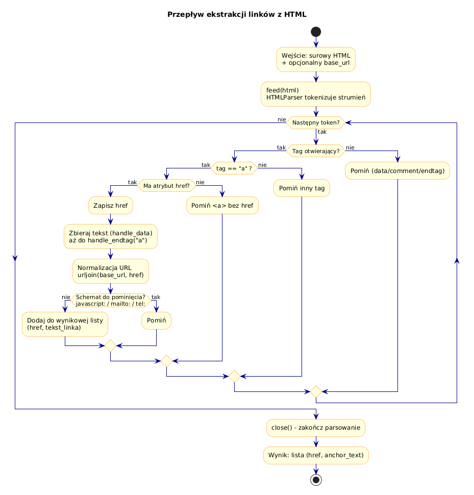

# 04 – Ekstrakcja Linków z HTML (Szczegółowe Omówienie)

> **Cel:** Krok po kroku zbudować ekstraktor linków z dokumentu HTML używając `HTMLParser`. Zrozumieć, skąd pochodzą linki w HTML, jak je wyciągać, filtrować i normalizować.

---

## 1. Gdzie w HTML znajdują się linki?

Linki (URL-e) pojawiają się w HTML w **atrybutach** różnych tagów:

| Tag | Atrybut | Co zawiera |
|---|---|---|
| `<a>` | `href` | Hiperłącze do innej strony lub zasobu |
| `` | `src` | Ścieżka do obrazka |
| `<script>` | `src` | Ścieżka do pliku JavaScript |
| `<link>` | `href` | Arkusz stylów CSS, favicon, itp. |
| `<iframe>` | `src` | Osadzona strona |
| `<form>` | `action` | URL docelowy formularza |
| `<video>` | `src` | Plik wideo |
| `<audio>` | `src` | Plik audio |
| `<source>` | `src` | Alternatywne źródło media |

---

## 2. Budowa ekstrakcji krok po kroku

### Krok 1: Minimalny parser wyciągający `href` z `<a>`

```python
from html.parser import HTMLParser

class LinkExtractor(HTMLParser):
    def __init__(self):
        super().__init__()
        self.links: list[str] = []

    def handle_starttag(self, tag, attrs):
        if tag == "a":
            for name, value in attrs:
                if name == "href" and value:
                    self.links.append(value)
```

**Jak to działa:**

1. Parser natrafia na `<a href="https://example.com" class="link">`.
2. Wywołuje `handle_starttag("a", [("href", "https://example.com"), ("class", "link")])`.
3. Nasza implementacja iteruje po atrybutach, szukając `href`.
4. Znajdując `href`, dodaje wartość do listy `self.links`.

### Krok 2: Użycie

```python
html = """
<html>
<body>
    <a href="https://python.org">Python</a>
    <a href="/about">O nas</a>
    <a href="mailto:info@example.com">Kontakt</a>
    <p>Tekst bez linka</p>
    <a href="https://docs.python.org">Dokumentacja</a>
</body>
</html>
"""

parser = LinkExtractor()
parser.feed(html)
print(parser.links)
# ['https://python.org', '/about', 'mailto:info@example.com', 'https://docs.python.org']
```

### Krok 3: Wyciąganie tekstu linka (anchor text)

Często chcemy wiedzieć nie tylko **dokąd** prowadzi link, ale też **jaki tekst** jest wyświetlany:

```python
class LinkWithText(HTMLParser):
    def __init__(self):
        super().__init__()
        self.links: list[tuple[str, str]] = []  # (href, tekst)
        self._href: str | None = None
        self._text: str = ""

    def handle_starttag(self, tag, attrs):
        if tag == "a":
            attrs_dict = dict(attrs)
            href = attrs_dict.get("href")
            if href:
                self._href = href
                self._text = ""

    def handle_data(self, data):
        if self._href is not None:
            self._text += data

    def handle_endtag(self, tag):
        if tag == "a" and self._href is not None:
            self.links.append((self._href, self._text.strip()))
            self._href = None
            self._text = ""
```

**Wynik:**
```python
# [('https://python.org', 'Python'), ('/about', 'O nas'), ...]
```

---

## 3. Rodzaje URL-i w HTML

| Typ | Przykład | Opis |
|---|---|---|
| Absolutny | `https://example.com/page` | Pełny URL z protokołem |
| Relatywny do korzenia | `/about/team` | Względem domeny |
| Relatywny do ścieżki | `../images/logo.png` | Względem bieżącego URL |
| Fragment | `#section-2` | Kotwica na tej samej stronie |
| Mailto | `mailto:user@example.com` | Link e-mail |
| Tel | `tel:+48123456789` | Link telefoniczny |
| JavaScript | `javascript:void(0)` | Pseudo-link (ignorujemy) |

---

## 4. Normalizacja URL-i z `urllib.parse`

Aby zamienić ścieżki relatywne na absolutne, używamy `urllib.parse.urljoin`:

```python
from urllib.parse import urljoin

base_url = "https://example.com/blog/post.html"

urljoin(base_url, "/about")
# 'https://example.com/about'

urljoin(base_url, "../images/logo.png")
# 'https://example.com/images/logo.png'

urljoin(base_url, "https://other.com")
# 'https://other.com'  (absolutny URL nie zmienia się)

urljoin(base_url, "#top")
# 'https://example.com/blog/post.html#top'
```

---

## 5. Filtrowanie linków

### Tylko linki HTTP/HTTPS (zewnętrzne)

```python
def filtruj_http(links: list[str]) -> list[str]:
    return [l for l in links if l.startswith(("http://", "https://"))]
```

### Linki zewnętrzne (inna domena)

```python
from urllib.parse import urlparse

def filtruj_zewnetrzne(links: list[str], base_domain: str) -> list[str]:
    zewnetrzne = []
    for link in links:
        parsed = urlparse(link)
        if parsed.netloc and parsed.netloc != base_domain:
            zewnetrzne.append(link)
    return zewnetrzne
```

### Pomijanie specjalnych schematów

```python
_IGNOROWANE = ("javascript:", "mailto:", "tel:", "#")

def filtruj_nawigacyjne(links: list[str]) -> list[str]:
    return [l for l in links if not l.startswith(_IGNOROWANE)]
```

---

## 6. Kompletny ekstraktor – diagram przepływu

```
HTML wejściowy
     │
     ▼
┌─────────────┐
│  feed(html) │  HTMLParser tokenizuje strumień
└──────┬──────┘
       │
       ▼
┌──────────────────────┐
│ handle_starttag(tag)  │  Czy tag == "a"?
│                       │  Czy ma atrybut href?
└──────┬───────────────┘
       │ tak
       ▼
┌──────────────────────┐
│ Zbierz href + tekst  │  handle_data + handle_endtag
└──────┬───────────────┘
       │
       ▼
┌──────────────────────┐
│ Normalizacja URL     │  urljoin(base, href)
└──────┬───────────────┘
       │
       ▼
┌──────────────────────┐
│ Filtrowanie          │  Pomijamy javascript:, mailto:, #
└──────┬───────────────┘
       │
       ▼
   Lista linków
```



---

## 7. Pułapki i dobre praktyki

1. **Atrybut `href` może nie istnieć** – `<a name="anchor">` nie ma `href`.
2. **Wielkość liter tagów** – HTMLParser normalizuje nazwy tagów do **lowercase**.
3. **Białe znaki w URL** – mogą pojawić się w źle sformatowanym HTML.
4. **Duplikaty** – ten sam link może pojawić się wielokrotnie; użyj `set` lub `dict.fromkeys` do deduplikacji z zachowaniem kolejności.
5. **Kodowanie** – URL-e mogą zawierać znaki zakodowane (`%20`); `urllib.parse.unquote` je odkoduje.

---

## Większy przykład

- [`examples/link_extractor.py`](examples/link_extractor.py) – kompletny, bogato komentowany ekstraktor linków z normalizacją i filtrowaniem.

