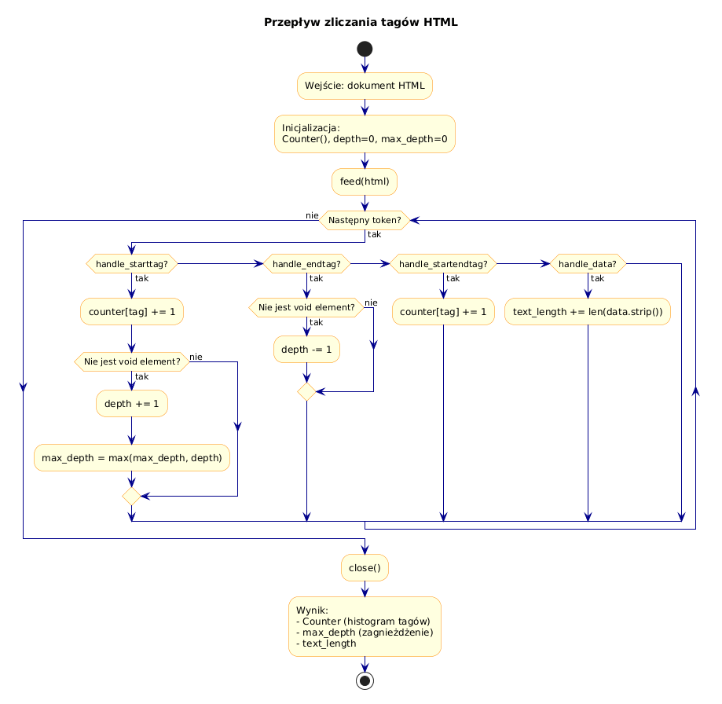

# 05 – Zliczanie Tagów HTML

> **Cel:** Zbudować narzędzie do analizy struktury dokumentu HTML: histogram częstości tagów, identyfikacja najczęstszych elementów i pomiar głębokości zagnieżdżenia.

---

## 1. Zliczanie tagów – po co?

Analiza częstości tagów HTML jest przydatna do:
- **Audytu SEO** – ile jest nagłówków `<h1>`, `<h2>`? Czy `` mają `alt`?
- **Profilowania dokumentu** – ile tagów ma strona? Jaka jest proporcja struktury do treści?
- **Debugowania** – wykrywanie nadmiarowych `<div>` lub brakujących zamknięć.
- **Statystyk** – porównanie struktury różnych stron.

---

## 2. Prosty licznik z `collections.Counter`

```python
from html.parser import HTMLParser
from collections import Counter

class TagCounter(HTMLParser):
    def __init__(self):
        super().__init__()
        self.counter = Counter()

    def handle_starttag(self, tag, attrs):
        self.counter[tag] += 1

    def handle_startendtag(self, tag, attrs):
        self.counter[tag] += 1

html = "<div><p>A</p><p>B</p><br><span>C</span></div>"
parser = TagCounter()
parser.feed(html)
print(parser.counter)
# Counter({'p': 2, 'div': 1, 'br': 1, 'span': 1})

print(parser.counter.most_common(3))
# [('p', 2), ('div', 1), ('br', 1)]
```

---

## 3. Głębokość zagnieżdżenia

Głębokość zagnieżdżenia to liczba tagów otwierających na stosie w danym momencie:

```python
class NestingDepth(HTMLParser):
    """Mierzy maksymalna glebokosc zagniezdzenia tagow HTML."""

    VOID = frozenset({"br", "hr", "img", "input", "meta", "link",
                      "area", "base", "col", "embed", "source", "track", "wbr"})

    def __init__(self):
        super().__init__()
        self.current_depth = 0
        self.max_depth = 0

    def handle_starttag(self, tag, attrs):
        if tag not in self.VOID:
            self.current_depth += 1
            self.max_depth = max(self.max_depth, self.current_depth)

    def handle_endtag(self, tag):
        if tag not in self.VOID:
            self.current_depth = max(0, self.current_depth - 1)
```

### Przykład

```html
<html>           <!-- depth 1 -->
  <body>         <!-- depth 2 -->
    <div>        <!-- depth 3 -->
      <p>        <!-- depth 4 -->
        <b>X</b> <!-- depth 5 (max!) -->
      </p>
    </div>
  </body>
</html>
```

```python
parser = NestingDepth()
parser.feed(html)
print(parser.max_depth)  # 5
```

---

## 4. Histogram z formatowaniem ASCII

```python
def drukuj_histogram(counter: Counter, top_n: int = 10) -> None:
    """Drukuje histogram czestosci tagow jako slupki ASCII."""
    najczestsze = counter.most_common(top_n)
    if not najczestsze:
        return
    max_count = najczestsze[0][1]
    max_bar = 40

    for tag, count in najczestsze:
        bar_len = int(count / max_count * max_bar)
        bar = "█" * bar_len
        print(f"  {tag:12s} | {bar} ({count})")
```

**Wyjście:**
```
  div          | ████████████████████████████████████████ (15)
  p            | ██████████████████████████ (10)
  span         | █████████████ (5)
  a            | ██████████ (4)
  img          | █████ (2)
```

---

## 5. Łączenie licznika z głębokością

Można stworzyć jedną klasę, która zbiera **wszystkie metryki**:

```python
class HTMLAnalyzer(HTMLParser):
    VOID = frozenset({...})

    def __init__(self):
        super().__init__()
        self.tag_counts = Counter()
        self.depth = 0
        self.max_depth = 0
        self.text_length = 0

    def handle_starttag(self, tag, attrs):
        self.tag_counts[tag] += 1
        if tag not in self.VOID:
            self.depth += 1
            self.max_depth = max(self.max_depth, self.depth)

    def handle_endtag(self, tag):
        if tag not in self.VOID:
            self.depth = max(0, self.depth - 1)

    def handle_data(self, data):
        self.text_length += len(data.strip())

    def handle_startendtag(self, tag, attrs):
        self.tag_counts[tag] += 1
```



---

## Większy przykład

- [`examples/tag_counter.py`](examples/tag_counter.py) – kompletny analizator HTML ze statystykami, histogramem i głębokością zagnieżdżenia.

