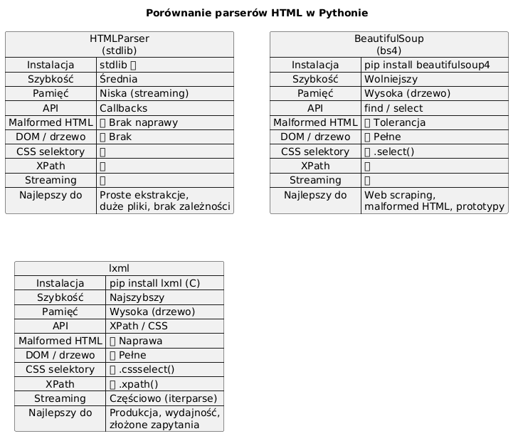

# 06 – Ograniczenia HTMLParser i Alternatywy

> **Cel:** Zrozumienie, kiedy `HTMLParser` jest wystarczający, a kiedy lepiej sięgnąć po biblioteki takie jak BeautifulSoup czy lxml. Poznanie ograniczeń parsera strumieniowego i porównanie z alternatywami.

---

## 1. Ograniczenia `html.parser.HTMLParser`

### 1.1 Brak drzewa DOM

`HTMLParser` **nie buduje żadnej struktury danych** – przetwarza tokeny strumieniowo. Nie da się:

- Przejść do rodzica, rodzeństwa lub dzieci tagu.
- Wyszukiwać elementów po CSS selektorach (`.class`, `#id`).
- Wykonywać zapytań XPath.

Jeśli potrzebujesz **nawigować** po dokumencie, musisz sam zbudować drzewo lub użyć biblioteki, która to robi.

### 1.2 Brak naprawy uszkodzonego HTML (malformed HTML)

HTMLParser **nie naprawia** błędnego HTML-a:

```python
from html.parser import HTMLParser

class Debug(HTMLParser):
    def handle_starttag(self, tag, attrs):
        print(f"START: {tag}")
    def handle_endtag(self, tag):
        print(f"END: {tag}")

parser = Debug()
parser.feed("<p>Akapit bez zamknięcia<div>Nowy blok</div>")
```

**Wyjście:**
```
START: p
START: div
END: div
```

Parser nie zgłasza błędu o brakującym `</p>` – po prostu kontynuuje. Przeglądarki natomiast mają zaawansowane algorytmy naprawcze (HTML5 Tree Construction).

### 1.3 Brak obsługi CSS selektorów

Nie da się napisać:
```python
# NIE ISTNIEJE w HTMLParser:
parser.select("div.content > p.first")
parser.find_all("a", class_="external")
```

### 1.4 Brak walidacji struktury

HTMLParser nie sprawdza:
- Czy tagi są poprawnie zagnieżdżone.
- Czy użyto prawidłowych nazw tagów.
- Czy atrybuty są dozwolone dla danego tagu.

### 1.5 Problemy z niektórymi konstrukcjami

```python
# Tagi <script> i <style> – zawartość jest traktowana jako dane (CDATA)
parser.feed("<script>if (a < b) {}</script>")  # '<' wewnątrz script
# HTMLParser radzi sobie z tym poprawnie od Python 3.x,
# ale starsze wersje miały problemy.
```

---

## 2. Kiedy HTMLParser jest wystarczający?

✅ HTMLParser jest **dobrym wyborem** gdy:

| Scenariusz | Dlaczego wystarczy |
|---|---|
| Ekstrakcja linków z `<a href>` | Prosta iteracja po tagach |
| Zliczanie tagów | Nie wymaga drzewa |
| Wyciąganie tekstu (strip tags) | Prosty `handle_data` |
| Parsowanie dobrze uformowanego HTML | Nie trzeba naprawiać |
| Środowisko bez zewnętrznych zależności | `html.parser` jest w stdlib |
| Przetwarzanie bardzo dużych plików | Niskie zużycie pamięci (streaming) |

❌ HTMLParser jest **niewystarczający** gdy:

| Scenariusz | Dlaczego nie wystarczy |
|---|---|
| Nawigacja po drzewie DOM | Brak drzewa |
| CSS selektory / XPath | Brak API |
| Malformed HTML z internetu | Brak naprawy |
| Złożone transformacje HTML | Zbyt niskopoziomowy |
| Web scraping | Za mało wygodny |

---

## 3. Alternatywa 1: BeautifulSoup (bs4)

**Instalacja:** `pip install beautifulsoup4`

```python
from bs4 import BeautifulSoup

html = '<div class="content"><p>Hello <b>World</b></p></div>'
soup = BeautifulSoup(html, "html.parser")  # lub "lxml", "html5lib"

# Nawigacja po drzewie
print(soup.div.p.b.string)        # "World"

# CSS selektory
for p in soup.select("div.content > p"):
    print(p.get_text())            # "Hello World"

# Wyszukiwanie
links = soup.find_all("a", class_="external")

# Naprawia malformed HTML
broken = "<p>Akapit<div>Blok</div>"
soup2 = BeautifulSoup(broken, "html.parser")
print(soup2.prettify())
```

### Zalety BeautifulSoup

- **Przyjazne API** – `find()`, `find_all()`, `select()`, `get_text()`.
- **Tolerancja błędów** – radzi sobie z uszkodzonym HTML.
- **Wiele backendów** – `html.parser` (stdlib), `lxml` (szybki), `html5lib` (jak przeglądarka).
- **Nawigacja** – `.parent`, `.children`, `.next_sibling`, `.find_next()`.

### Wady BeautifulSoup

- **Zależność zewnętrzna** – wymaga instalacji.
- **Wolniejszy** niż lxml dla dużych dokumentów.
- **Buduje drzewo** – wyższe zużycie pamięci niż HTMLParser.

---

## 4. Alternatywa 2: lxml

**Instalacja:** `pip install lxml`

```python
from lxml import html

doc = html.fromstring('<div class="content"><p>Hello</p></div>')

# XPath
paragraphs = doc.xpath('//div[@class="content"]/p/text()')
print(paragraphs)  # ['Hello']

# CSS selektory (z cssselect)
for el in doc.cssselect("div.content p"):
    print(el.text_content())

# Bardzo szybki parser C
```

### Zalety lxml

- **Najszybszy** parser HTML/XML w Pythonie (implementacja w C).
- **XPath** – pełne wsparcie dla zapytań XPath 1.0.
- **CSS selektory** – przez `cssselect`.
- **Naprawa HTML** – `lxml.html` naprawia malformed HTML.

### Wady lxml

- **Zależność binarna** – wymaga kompilacji C (lub wheel).
- **Trudniejsza instalacja** – może sprawiać problemy na niektórych platformach.
- **Zużycie pamięci** – buduje pełne drzewo.

---

## 5. Porównanie HTMLParser vs BeautifulSoup vs lxml

| Cecha | HTMLParser | BeautifulSoup | lxml |
|---|---|---|---|
| **Instalacja** | stdlib ✅ | `pip install` | `pip install` (C) |
| **Szybkość** | Średnia | Wolniejszy | Najszybszy |
| **Pamięć** | Niska (streaming) | Wysoka (drzewo) | Wysoka (drzewo) |
| **API** | Callbacks | find/select | XPath/CSS |
| **Malformed HTML** | ❌ Brak naprawy | ✅ Tolerancja | ✅ Naprawa |
| **DOM / drzewo** | ❌ Brak | ✅ Pełne | ✅ Pełne |
| **CSS selektory** | ❌ | ✅ `.select()` | ✅ `.cssselect()` |
| **XPath** | ❌ | ❌ | ✅ `.xpath()` |
| **Streaming** | ✅ | ❌ | Częściowo (iterparse) |



---

## 6. Decyzja: który parser wybrać?

```
Czy masz kontrolę nad HTML-em (dobrze uformowany)?
├── TAK → Czy potrzebujesz nawigacji / selektorów?
│         ├── TAK → BeautifulSoup lub lxml
│         └── NIE → HTMLParser ✅
└── NIE (HTML z internetu, malformed)
    ├── Potrzebujesz szybkości → lxml
    └── Potrzebujesz prostoty → BeautifulSoup
```

---

## 7. Przykład: to samo zadanie w trzech bibliotekach

**Zadanie:** Wyciągnij tekst ze wszystkich `<p>` w `<div class="content">`.

### HTMLParser

```python
from html.parser import HTMLParser

class ParagraphExtractor(HTMLParser):
    def __init__(self):
        super().__init__()
        self._in_div = False
        self._in_p = False
        self.texts = []
        self._text = ""

    def handle_starttag(self, tag, attrs):
        if tag == "div" and ("class", "content") in attrs:
            self._in_div = True
        elif tag == "p" and self._in_div:
            self._in_p = True
            self._text = ""

    def handle_data(self, data):
        if self._in_p:
            self._text += data

    def handle_endtag(self, tag):
        if tag == "p" and self._in_p:
            self.texts.append(self._text.strip())
            self._in_p = False
        elif tag == "div":
            self._in_div = False
```

### BeautifulSoup (3 linie)

```python
from bs4 import BeautifulSoup
soup = BeautifulSoup(html, "html.parser")
texts = [p.get_text() for p in soup.select("div.content > p")]
```

### lxml (3 linie)

```python
from lxml.html import fromstring
doc = fromstring(html)
texts = [p.text_content() for p in doc.cssselect("div.content > p")]
```

> Wniosek: Im bardziej złożone zapytanie, tym więcej kodu wymaga HTMLParser w porównaniu z BS4/lxml.

---

## Większy przykład

- [`examples/alternatives_demo.py`](examples/alternatives_demo.py) – porównanie HTMLParser z BeautifulSoup na tym samym dokumencie (BeautifulSoup opcjonalny).

