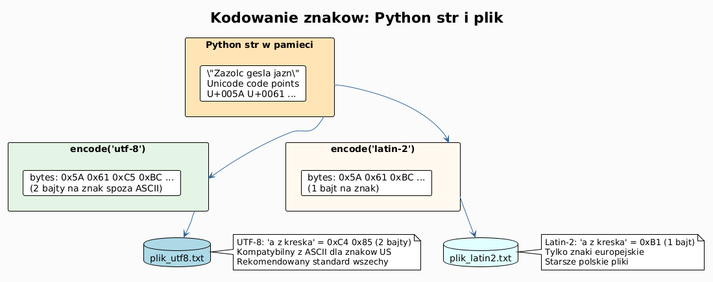
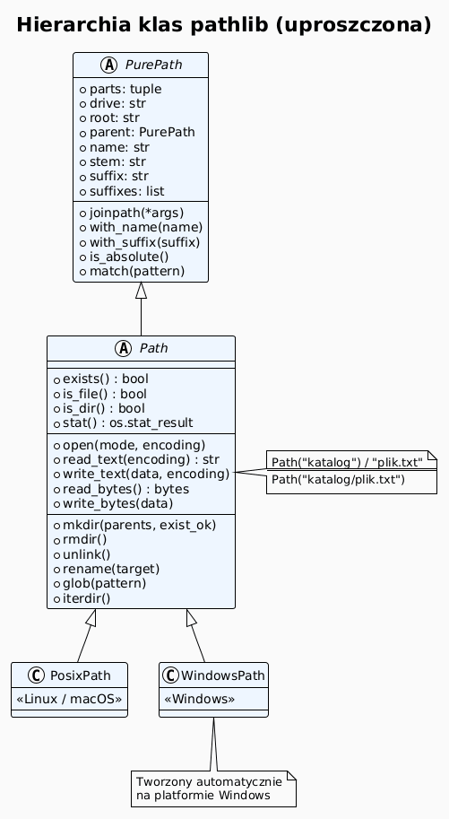
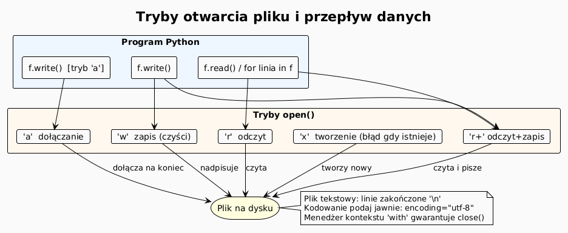

# 01 – Pliki tekstowe: tryby, kodowania, pathlib

## Cel

Opanować pełen cykl pracy z plikami tekstowymi w Pythonie: otwieranie, czytanie,
zapisywanie, dołączanie, wyszukiwanie zawartości oraz wygodną pracę ze ścieżkami
przy użyciu biblioteki `pathlib`.

---

## 1. Dlaczego pliki są ważne?

Plik tekstowy to najpowszechniejsza forma trwałego przechowywania danych —
od plików konfiguracyjnych (`.ini`, `.toml`, `.yaml`) po logi, CSV, kod źródłowy
i dokumentację. Python oferuje bogaty, ustandaryzowany interfejs do ich obsługi.

---

## 2. Tryby otwarcia pliku

Funkcja `open()` przyjmuje drugi argument — **tryb** — który określa, co zamierzamy
robić z plikiem.

| Tryb | Opis | Tworzy plik? | Czyści zawartość? |
|------|------|-------------|------------------|
| `'r'` | odczyt (domyślny) | nie | nie |
| `'w'` | zapis (nadpisuje) | tak | tak |
| `'a'` | dołączanie na koniec | tak | nie |
| `'x'` | ekskluzywne tworzenie (błąd, gdy istnieje) | tak | — |
| `'r+'` | odczyt + zapis | nie | nie |
| `'w+'` | zapis + odczyt | tak | tak |

Do trybów można dodać `'b'` (binarny) lub `'t'` (tekstowy, domyślny).

```python
# Zapis
with open("notatka.txt", "w", encoding="utf-8") as f:
    f.write("Pierwsza linia\n")
    f.write("Druga linia\n")

# Odczyt całości
with open("notatka.txt", "r", encoding="utf-8") as f:
    tekst = f.read()

# Odczyt linia po linii (efektywny dla dużych plików)
with open("notatka.txt", encoding="utf-8") as f:
    for linia in f:
        print(linia.rstrip("\n"))

# Dołączanie
with open("notatka.txt", "a", encoding="utf-8") as f:
    f.write("Trzecia linia\n")
```

> **Reguła:** zawsze podawaj `encoding="utf-8"` jawnie — domyślne kodowanie
> zależy od systemu operacyjnego i może być inne na Windows (cp1250) i Linux (UTF-8).

---

## 3. Kodowania znaków

Tekst przechowywany w pliku to ciąg bajtów — dopiero **kodowanie** decyduje,
jakie znaki te bajty reprezentują.

```
Znak 'ą'  →  Unicode U+0105
          →  UTF-8:    0xC4 0x85  (2 bajty)
          →  Latin-2:  0xB1       (1 bajt)
          →  ASCII:    niemożliwe (błąd)
```

```python
# UTF-8 — rekomendowane na wszystkich platformach
with open("utf8.txt", "w", encoding="utf-8") as f:
    f.write("Zażółć gęślą jaźń\n")

# Latin-2 (ISO-8859-2) — starsze polskie pliki
with open("latin2.txt", "w", encoding="latin-2") as f:
    f.write("Zażółć gęślą jaźń\n")

# Ręczne kodowanie i dekodowanie
bajty = "Zażółć".encode("utf-8")   # bytes
tekst = bajty.decode("utf-8")       # str

# Obsługa błędów
with open("nieznane.txt", "r", encoding="utf-8", errors="replace") as f:
    # '?' w miejscu nieznanych bajtów
    tekst = f.read()
```

### Diagram: Unicode → kodowanie → bajty



---

## 4. Interfejs pliku tekstowego — przegląd metod

```python
with open("plik.txt", "r+", encoding="utf-8") as f:
    # Odczyt
    calosc = f.read()          # cały plik jako str
    linia  = f.readline()      # jedna linia
    linie  = f.readlines()     # lista linii

    # Zapis
    f.write("tekst")           # zwraca liczbę znaków
    f.writelines(["a\n","b\n"])

    # Pozycja
    pos = f.tell()             # aktualna pozycja w bajtach
    f.seek(0)                  # wróć na początek

    # Informacje
    print(f.name)              # nazwa pliku
    print(f.mode)              # tryb
    print(f.encoding)          # kodowanie
    print(f.closed)            # czy zamknięty
```

---

## 5. Biblioteka `pathlib` — nowoczesna praca ze ścieżkami

`pathlib.Path` (Python 3.4+) zastępuje `os.path` i oferuje czytelny, obiektowy
interfejs do ścieżek plików.

```python
from pathlib import Path

# Tworzenie ścieżki (przenośne — działa na Windows i Linux)
p = Path("dane") / "rok2024" / "wyniki.csv"
# dane/rok2024/wyniki.csv

# Komponenty ścieżki
print(p.parent)    # dane/rok2024
print(p.name)      # wyniki.csv
print(p.stem)      # wyniki
print(p.suffix)    # .csv
print(p.parts)     # ('dane', 'rok2024', 'wyniki.csv')

# Sprawdzanie
print(p.exists())  # czy istnieje
print(p.is_file()) # czy plik
print(p.is_dir())  # czy katalog

# Tworzenie katalogów
p.parent.mkdir(parents=True, exist_ok=True)

# Zapis i odczyt (shortcut — bez open())
p.write_text("zawartość", encoding="utf-8")
tekst = p.read_text(encoding="utf-8")
bajty = p.read_bytes()

# Glob — wyszukiwanie plików
for plik in Path(".").glob("**/*.txt"):
    print(plik)

# Zmiana nazwy / przenoszenie
nowa = p.with_suffix(".tsv")
p.rename(nowa)

# Usuwanie
nowa.unlink()          # usuwa plik
Path("pusty_kat").rmdir()  # usuwa pusty katalog
```

### Diagram: hierarchia klas pathlib



---

## 6. Wzorce pracy z plikami tekstowymi

### 6.1 Filtrowanie linii

```python
from pathlib import Path

def filtruj_linie(sciezka: Path, fraza: str) -> list[str]:
    """Zwraca linie zawierające frazę."""
    with sciezka.open(encoding="utf-8") as f:
        return [linia.rstrip() for linia in f if fraza in linia]

wyniki = filtruj_linie(Path("log.txt"), "ERROR")
```

### 6.2 Liczenie słów i znaków

```python
def statystyki(sciezka: Path) -> dict:
    tekst = sciezka.read_text(encoding="utf-8")
    slowa = tekst.split()
    return {
        "znaki":   len(tekst),
        "slowa":   len(slowa),
        "linie":   tekst.count("\n"),
        "unikalne": len(set(w.lower() for w in slowa)),
    }
```

### 6.3 Transformacja pliku linia po linii

```python
def zamien_w_pliku(zrodlo: Path, cel: Path, stare: str, nowe: str) -> int:
    """Zamienia wszystkie wystąpienia i zwraca liczbę zmian."""
    licznik = 0
    with zrodlo.open(encoding="utf-8") as src, cel.open("w", encoding="utf-8") as dst:
        for linia in src:
            nowa_linia, n = linia.replace(stare, nowe), linia.count(stare)
            dst.write(nowa_linia if n else linia)
            licznik += n
    return licznik
```

### 6.4 Pliki CSV bez biblioteki

```python
def czytaj_csv(sciezka: Path, separator: str = ",") -> list[dict]:
    with sciezka.open(encoding="utf-8") as f:
        naglowek = f.readline().rstrip().split(separator)
        return [
            dict(zip(naglowek, linia.rstrip().split(separator)))
            for linia in f
            if linia.strip()
        ]
```

---

## 7. Mini-lab krok po kroku

### Krok 1 — utwórz plik z danymi

```python
from pathlib import Path

dane = Path("studenci.txt")
dane.write_text(
    "Anna Kowalska,85\nPiotr Nowak,72\nMaria Wiśniewska,91\n",
    encoding="utf-8"
)
```

### Krok 2 — wczytaj i przetworz

```python
wyniki = []
with dane.open(encoding="utf-8") as f:
    for linia in f:
        imie_nazwisko, punkty = linia.rstrip().split(",")
        wyniki.append((imie_nazwisko, int(punkty)))
```

### Krok 3 — posortuj i zapisz raport

```python
wyniki.sort(key=lambda x: x[1], reverse=True)
raport = Path("raport.txt")
with raport.open("w", encoding="utf-8") as f:
    f.write("Ranking studentów\n")
    f.write("=" * 30 + "\n")
    for miejsce, (student, punkty) in enumerate(wyniki, 1):
        f.write(f"{miejsce}. {student}: {punkty} pkt\n")

print(raport.read_text(encoding="utf-8"))
```

---

## 8. Diagram: tryby pliku i operacje



---

## 9. Pytania kontrolne

1. Jaka jest różnica między trybem `'w'` a `'a'`? Kiedy użyć każdego z nich?
2. Co się stanie, gdy otworzysz nieistniejący plik w trybie `'r'`?
3. Dlaczego zalecamy jawne podanie `encoding="utf-8"`?
4. Jak `pathlib.Path` ułatwia pisanie przenośnego kodu w porównaniu z `os.path`?
5. Co zwróci `Path("a/b/c.txt").stem`?
6. Jak efektywnie wczytać plik o rozmiarze 10 GB linia po linii?

---

## 10. Zadania

Zadania i rozwiązania: [exercises/](exercises/)

---

## 11. Literatura

- Python Docs – *Reading and Writing Files*: <https://docs.python.org/3/tutorial/inputoutput.html#reading-and-writing-files>
- Python Docs – `open()`: <https://docs.python.org/3/library/functions.html#open>
- Python Docs – `pathlib`: <https://docs.python.org/3/library/pathlib.html>
- Python Docs – `codecs` (kodowania): <https://docs.python.org/3/library/codecs.html#standard-encodings>
- Real Python – *Working With Files in Python*: <https://realpython.com/working-with-files-in-python/>
- Real Python – *Python's pathlib Module*: <https://realpython.com/python-pathlib/>
- D. Beazley & B. Jones, *Python Cookbook*, rozdz. 5 „Files and I/O".

