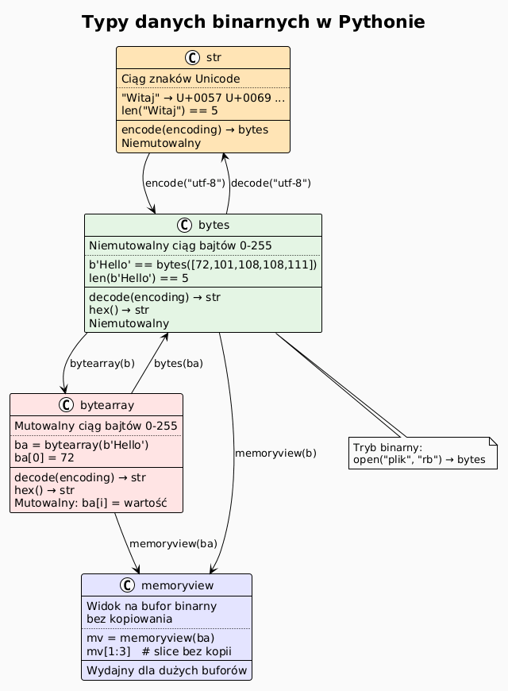
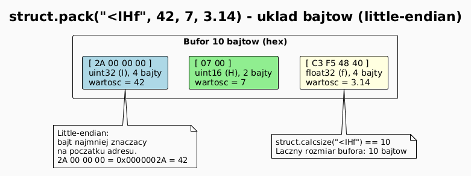
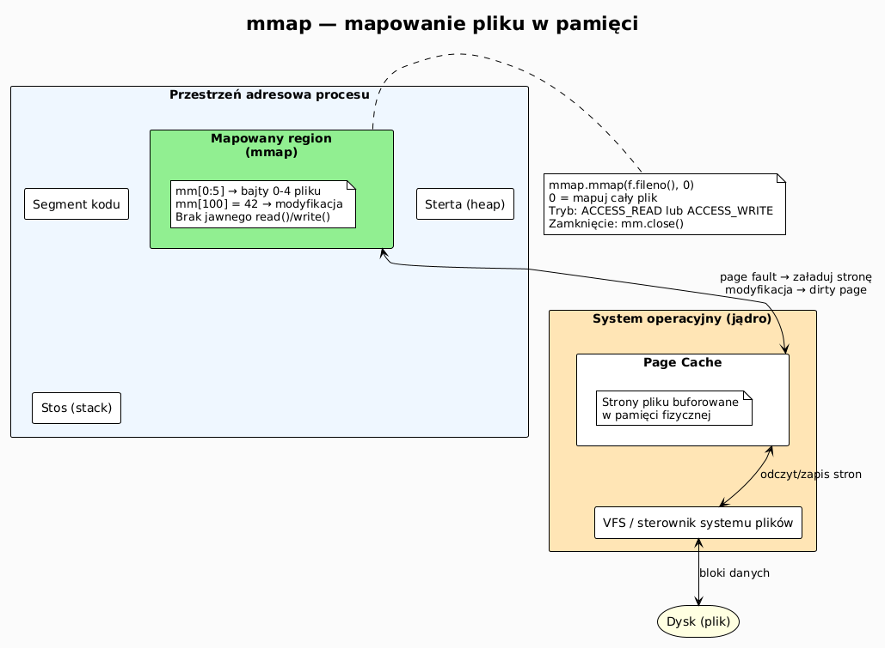
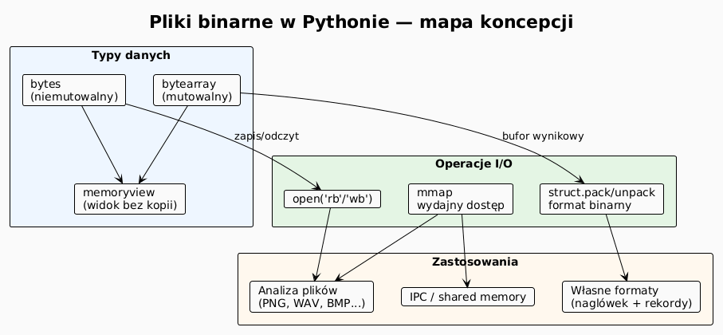

# 02 – Pliki binarne: struct, bytes, mmap

## Cel

Zrozumieć, czym różni się plik binarny od tekstowego, jak interpretować surowe bajty,
jak używać modułu `struct` do pakowania danych w binarny format oraz jak mapować plik
w pamięci przy użyciu `mmap`.

---

## 1. Plik binarny vs tekstowy

| Cecha | Plik tekstowy | Plik binarny |
|-------|--------------|--------------|
| Jednostka | znak (po dekodowaniu) | bajt (0–255) |
| Tryb otwarcia | `'r'`, `'w'`, `'a'` | `'rb'`, `'wb'`, `'ab'` |
| Konwersja końca linii | tak (zależy od OS) | nie |
| Typ danych | `str` | `bytes` |
| Przykłady | `.txt`, `.csv`, `.json` | `.png`, `.mp3`, `.exe`, `.pkl` |

```python
# Tryb binarny: read() zwraca bytes, nie str
with open("obraz.png", "rb") as f:
    naglowek = f.read(8)
    print(naglowek)          # b'\x89PNG\r\n\x1a\n'
    print(type(naglowek))    # <class 'bytes'>
```

---

## 2. Typ `bytes` i `bytearray`

```python
# Literał bytes
b1 = b"\x00\xFF\x41"        # 3 bajty: 0, 255, 65 ('A')
b2 = bytes([65, 66, 67])    # b'ABC'
b3 = "tekst".encode("utf-8")

# bytes jest niemutowalny
print(b1[0])                 # 0  (int, nie bajt!)
print(b1[1:])                # b'\xff\x41'

# bytearray — mutowalny odpowiednik
ba = bytearray(b"hello")
ba[0] = ord('H')             # zmiana bajtu
print(ba)                    # bytearray(b'Hello')
print(bytes(ba))             # b'Hello'

# Konwersja hex
print(b1.hex())              # '00ff41'
print(bytes.fromhex("00ff41"))  # b'\x00\xffA'
```

### Diagram: bytes vs bytearray vs str



---

## 3. Moduł `struct` — pakowanie danych

`struct` pozwala pakować liczby, znaki i inne typy w binarny bufor o precyzyjnie
określonym układzie bajtów (endianność, wyrównanie).

### Kody formatów

| Kod | Typ Python | Rozmiar |
|-----|-----------|---------|
| `b` / `B` | `int` (z/bez znaku 8-bit) | 1 bajt |
| `h` / `H` | `int` (16-bit) | 2 bajty |
| `i` / `I` | `int` (32-bit) | 4 bajty |
| `q` / `Q` | `int` (64-bit) | 8 bajtów |
| `f` / `d` | `float` 32/64-bit | 4/8 bajtów |
| `s` | `bytes` (n znaków) | n bajtów |
| `?` | `bool` | 1 bajt |

**Przedrostki endianności:**
- `<` — little-endian (Intel, domyślny na PC)
- `>` — big-endian (sieciowy, SPARC)
- `=` — natywny systemu
- `!` — sieciowy (= big-endian)

```python
import struct

# Pakowanie: 32-bit int LE + 64-bit double LE
dane = struct.pack("<Id", 42, 3.14)
print(dane.hex())   # 2a000000 1f85eb51b81e0940
print(len(dane))    # 12

# Rozpakowywanie
liczba, pi = struct.unpack("<Id", dane)
print(liczba, pi)   # 42  3.14

# Rozmiar formatu bez pakowania
print(struct.calcsize("<Id"))  # 12
```

### Diagram: struct.pack — układ bajtów



---

## 4. Własny format binarny — przykład rekordu

Projektujemy prosty format przechowujący pomiary temperatury:
- nagłówek: `TEMP` (4 bajty ASCII) + liczba rekordów (uint32 LE)
- rekord: timestamp (uint32 LE) + temperatura (float32 LE)

```
Offset  Rozmiar  Opis
------  -------  ----
0       4        Sygnatura 'TEMP'
4       4        Liczba rekordów (uint32)
8       8        Rekord 0: timestamp(4) + temperatura(4)
16      8        Rekord 1: ...
...
```

```python
import struct
from pathlib import Path
from dataclasses import dataclass

SYGNATURA = b"TEMP"
FORMAT_NAGLOWKA = "<4sI"          # sygnatura + liczba_rekordow
FORMAT_REKORDU  = "<If"           # timestamp + temperatura

@dataclass
class Pomiar:
    timestamp: int    # Unix timestamp
    temperatura: float

def zapisz_pomiary(sciezka: Path, pomiary: list[Pomiar]) -> None:
    with sciezka.open("wb") as f:
        # nagłówek
        f.write(struct.pack(FORMAT_NAGLOWKA, SYGNATURA, len(pomiary)))
        # rekordy
        for p in pomiary:
            f.write(struct.pack(FORMAT_REKORDU, p.timestamp, p.temperatura))

def czytaj_pomiary(sciezka: Path) -> list[Pomiar]:
    with sciezka.open("rb") as f:
        raw_h = f.read(struct.calcsize(FORMAT_NAGLOWKA))
        syg, liczba = struct.unpack(FORMAT_NAGLOWKA, raw_h)
        if syg != SYGNATURA:
            raise ValueError(f"Zła sygnatura: {syg!r}")
        rozmiar_r = struct.calcsize(FORMAT_REKORDU)
        return [
            Pomiar(*struct.unpack(FORMAT_REKORDU, f.read(rozmiar_r)))
            for _ in range(liczba)
        ]
```

---

## 5. Moduł `mmap` — mapowanie pliku w pamięci

`mmap` odwzorowuje plik bezpośrednio w przestrzeń adresową procesu.
Zamiast `read()`/`write()` operujemy na obiekcie zachowującym się jak `bytearray`,
a system operacyjny zarządza stronicowaniem.

**Kiedy `mmap` się opłaca?**
- duży plik, ale potrzebujemy tylko fragmentów (losowy dostęp),
- wyszukiwanie wzorców w dużym pliku,
- modyfikacja wybranych bajtów bez przepisywania całości,
- współdzielenie pamięci między procesami.

```python
import mmap
from pathlib import Path

# Tworzenie pliku testowego
p = Path("duzy.bin")
p.write_bytes(b"Hello, World!\n" * 1_000_000)

with p.open("r+b") as f:
    with mmap.mmap(f.fileno(), 0) as mm:   # 0 = cały plik
        # losowy dostęp jak do bytearray
        print(mm[0:5])           # b'Hello'
        mm[0:5] = b"Witaj"      # modyfikacja in-place

        # wyszukiwanie
        pos = mm.find(b"World")
        print(f"'World' na pozycji: {pos}")

        # metody jak na pliku
        mm.seek(0)
        linia = mm.readline()
        print(linia)
```

### Diagram: mmap — mapowanie pliku



---

## 6. Analiza nagłówka pliku PNG

Każdy plik PNG zaczyna się od 8-bajtowej sygnatury `\x89PNG\r\n\x1a\n`,
po której następują chunki. Pierwszy chunk to zawsze `IHDR` z rozmiarem obrazu.

```python
import struct
from pathlib import Path

def info_png(sciezka: Path) -> dict:
    """Odczytuje podstawowe informacje z pliku PNG."""
    PNG_SIG = b"\x89PNG\r\n\x1a\n"
    with sciezka.open("rb") as f:
        sig = f.read(8)
        if sig != PNG_SIG:
            raise ValueError("To nie jest plik PNG!")
        # IHDR chunk: 4 długość + 4 typ + 13 danych
        dlugosc = struct.unpack(">I", f.read(4))[0]
        typ = f.read(4)
        # dane IHDR: szerokość, wysokość, głębia, typ koloru...
        szerokosc, wysokosc, glab, kol = struct.unpack(">IIBB", f.read(10))
        return {
            "chunk":     typ.decode("ascii"),
            "szerokosc": szerokosc,
            "wysokosc":  wysokosc,
            "glab_bitu": glab,
            "typ_koloru": kol,
        }
```

---

## 7. Mini-lab krok po kroku

### Krok 1 — zbuduj własny format binarny

```python
import struct
from pathlib import Path

FORMAT = "<Hf"  # uint16 + float32 = 6 bajtów
dane = [(1, 36.6), (2, 37.1), (3, 36.9)]

p = Path("temp.bin")
with p.open("wb") as f:
    f.write(struct.pack("<I", len(dane)))  # nagłówek: liczba rekordów
    for id_, temp in dane:
        f.write(struct.pack(FORMAT, id_, temp))

print(f"Rozmiar pliku: {p.stat().st_size} bajtów")
```

### Krok 2 — odczytaj i wyświetl

```python
with p.open("rb") as f:
    (n,) = struct.unpack("<I", f.read(4))
    print(f"Rekordów: {n}")
    for _ in range(n):
        id_, temp = struct.unpack(FORMAT, f.read(struct.calcsize(FORMAT)))
        print(f"  ID={id_}  temp={temp:.1f}°C")
```

---

## 8. Diagram: temat 02 – przegląd



---

## 9. Pytania kontrolne

1. Jakie są konsekwencje otwarcia pliku binarnego w trybie tekstowym?
2. Czym różni się `bytes` od `bytearray`? Kiedy używać każdego?
3. Co oznacza przedrostek `<` w formacie `struct`? A `>`?
4. Dlaczego `mmap` jest wydajny przy losowym dostępie do dużego pliku?
5. Jak sprawdzić, że plik jest plikiem PNG, nie zaglądając do jego rozszerzenia?
6. Ile bajtów zajmie `struct.pack("<IHf", 1, 2, 3.14)`?

---

## 10. Zadania

Zadania i rozwiązania: [exercises/](exercises/)

---

## 11. Literatura

- Python Docs – `struct`: <https://docs.python.org/3/library/struct.html>
- Python Docs – `mmap`: <https://docs.python.org/3/library/mmap.html>
- Python Docs – `bytes` / `bytearray`: <https://docs.python.org/3/library/stdtypes.html#bytes-objects>
- Real Python – *Python's struct Module*: <https://realpython.com/python-struct-module/>
- Wikipedia – *PNG file format*: <https://en.wikipedia.org/wiki/PNG#File_format>
- D. Beazley & B. Jones, *Python Cookbook*, rozdz. 5 „Files and I/O", recepta 5.9–5.11.

