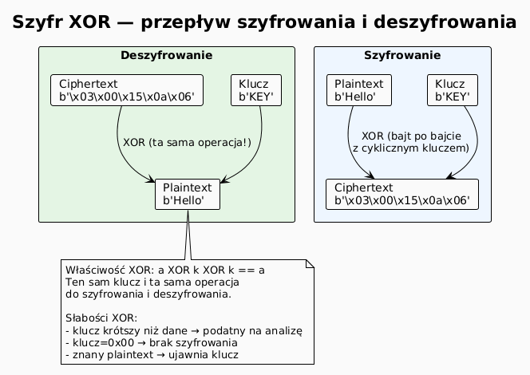
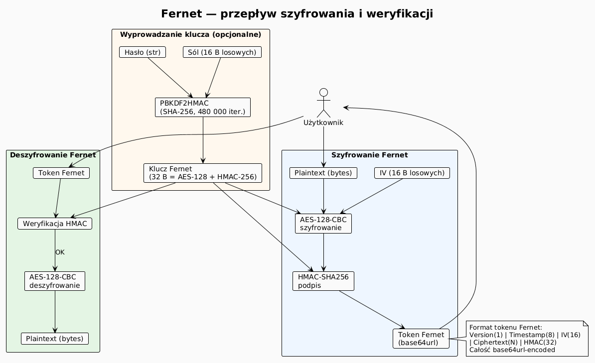
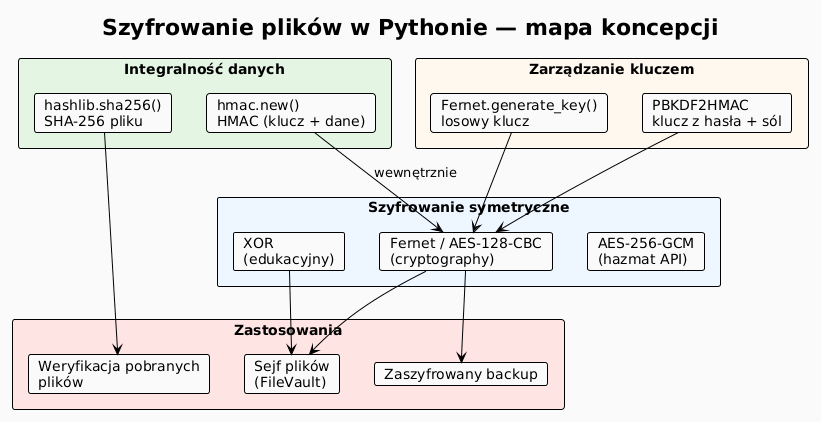

# 03 – Szyfrowanie plików: XOR, AES/Fernet, SHA-256

## Cel

Zrozumieć podstawowe techniki szyfrowania stosowane w programowaniu praktycznym:
szyfr XOR jako wprowadzenie do idei klucza, symetryczne szyfrowanie AES przez
bibliotekę `cryptography` (Fernet) oraz hashowanie SHA-256 do weryfikacji integralności
danych.

---

## 1. Czym jest szyfrowanie i po co go używamy?

**Szyfrowanie** (ang. *encryption*) to przekształcenie danych w postać nieczytelną
bez znajomości **klucza**. Cel: poufność i bezpieczeństwo danych.

Podstawowe pojęcia:

| Termin | Opis |
|--------|------|
| Plaintext | Dane oryginalne (jawne) |
| Ciphertext | Dane zaszyfrowane |
| Klucz | Sekretna informacja potrzebna do szyfrowania/deszyfrowania |
| Szyfrowanie symetryczne | Ten sam klucz do szyfrowania i deszyfrowania (np. AES) |
| Szyfrowanie asymetryczne | Para kluczy publiczny/prywatny (np. RSA) |
| Hash / skrót | Jednokierunkowe przekształcenie (np. SHA-256) |

---

## 2. Szyfr XOR — najprostszy przykład

Operacja XOR (exclusive OR) na bajtach to najprostszy sposób „szyfrowania":

```
bajt_zaszyfrowany = bajt_plaintext XOR bajt_klucza
bajt_plaintext    = bajt_zaszyfrowany XOR bajt_klucza   # tożsame!
```

Właściwość: **zastosowanie XOR dwa razy daje oryginał** (`a XOR k XOR k == a`).

```python
def xor_encrypt(dane: bytes, klucz: bytes) -> bytes:
    """Szyfruje/deszyfruje XOR-em z cyklicznym kluczem."""
    klucz_len = len(klucz)
    return bytes(b ^ klucz[i % klucz_len] for i, b in enumerate(dane))

plaintext     = b"Tajna wiadomosc!"
klucz         = b"SECRET"
ciphertext    = xor_encrypt(plaintext, klucz)
odzysk        = xor_encrypt(ciphertext, klucz)

print(ciphertext.hex())  # losowe bajty
print(odzysk)            # b'Tajna wiadomosc!'
```

> **Ważne:** XOR **nie jest bezpieczny** w praktycznych zastosowaniach (podatny na
> known-plaintext attack i frequency analysis). Służy jako ilustracja idei.

### Diagram: przepływ XOR



---

## 3. Hashowanie — integralność danych (SHA-256)

Hash (skrót kryptograficzny) to **jednokierunkowa** funkcja: z danych obliczamy
stały 256-bitowy „odcisk palca". Nawet zmiana jednego bitu zmienia hash całkowicie
(efekt lawinowy).

```python
import hashlib

def sha256_pliku(sciezka: str) -> str:
    """Oblicza SHA-256 pliku (blok po bloku — działa dla dowolnie dużych plików)."""
    h = hashlib.sha256()
    with open(sciezka, "rb") as f:
        for blok in iter(lambda: f.read(65_536), b""):
            h.update(blok)
    return h.hexdigest()

hash1 = sha256_pliku("raport.pdf")
# Po pobraniu pliku ze strony — porównaj hasha:
print("OK" if sha256_pliku("raport_pobrany.pdf") == hash1 else "USZKODZONY!")
```

| Algorytm | Długość | Bezpieczeństwo | Zastosowanie |
|----------|---------|---------------|-------------|
| MD5 | 128 bit | ❌ złamany | sumy kontrolne (nie krypto) |
| SHA-1 | 160 bit | ⚠️ słaby | Git (wewnętrznie) |
| SHA-256 | 256 bit | ✅ bezpieczny | podpisy, certyfikaty, blockchain |
| SHA-3 | 256+ bit | ✅ bezpieczny | nowoczesne systemy |
| BLAKE3 | 256 bit | ✅ bardzo szybki | nowe aplikacje |

---

## 4. Symetryczne szyfrowanie AES — biblioteka `cryptography`

**AES** (Advanced Encryption Standard) to standard szyfrowania symetrycznego
używany m.in. w TLS, Wi-Fi (WPA2), szyfrowaniu dysków.

Biblioteka `cryptography` dostarcza gotowy, bezpieczny interfejs:

```bash
pip install cryptography
```

### 4.1 Fernet — prosty i bezpieczny

**Fernet** to przepis (ang. *recipe*) oparty na AES-128-CBC z HMAC-SHA256.
Gwarantuje poufność **i** integralność wiadomości.

```python
from cryptography.fernet import Fernet

# Generuj klucz (zachowaj go bezpiecznie!)
klucz = Fernet.generate_key()        # 32 bajty zakodowane w base64
f = Fernet(klucz)

# Szyfrowanie
zaszyfrowane = f.encrypt(b"Tajne dane")
print(zaszyfrowane)   # b'gAAAAAB...'

# Deszyfrowanie
jawne = f.decrypt(zaszyfrowane)
print(jawne)          # b'Tajne dane'

# Deszyfrowanie z weryfikacją czasu (token wygasa po N sekundach)
jawne = f.decrypt(zaszyfrowane, ttl=60)   # wygasa po 60 sekundach
```

### 4.2 Szyfrowanie całego pliku

```python
from cryptography.fernet import Fernet
from pathlib import Path

def szyfruj_plik(sciezka: Path, klucz: bytes) -> Path:
    """Szyfruje plik i zapisuje jako <nazwa>.enc"""
    f = Fernet(klucz)
    zaszyfrowane = f.encrypt(sciezka.read_bytes())
    wynik = sciezka.with_suffix(".enc")
    wynik.write_bytes(zaszyfrowane)
    return wynik

def deszyfruj_plik(sciezka: Path, klucz: bytes) -> Path:
    """Deszyfruje plik .enc i zapisuje bez rozszerzenia .enc"""
    f = Fernet(klucz)
    jawne = f.decrypt(sciezka.read_bytes())
    wynik = sciezka.with_suffix("")
    wynik.write_bytes(jawne)
    return wynik

klucz = Fernet.generate_key()
zaszyfrowany = szyfruj_plik(Path("raport.pdf"), klucz)
odtworzony   = deszyfruj_plik(zaszyfrowany, klucz)
```

### 4.3 Przechowywanie klucza z hasłem (PBKDF2)

Klucza nie przechowujemy w pliku jako tekstu — wyprowadzamy go z **hasła** metodą
PBKDF2 (Password-Based Key Derivation Function 2).

```python
import base64
import os
from cryptography.hazmat.primitives.kdf.pbkdf2 import PBKDF2HMAC
from cryptography.hazmat.primitives import hashes

def klucz_z_hasla(haslo: str, sol: bytes | None = None) -> tuple[bytes, bytes]:
    """Wyprowadza klucz Fernet z hasła. Zwraca (klucz, sol)."""
    if sol is None:
        sol = os.urandom(16)    # losowa sól — przechowuj razem z danymi!
    kdf = PBKDF2HMAC(
        algorithm=hashes.SHA256(),
        length=32,
        salt=sol,
        iterations=480_000,     # OWASP 2023: min 210 000 dla SHA-256
    )
    klucz = base64.urlsafe_b64encode(kdf.derive(haslo.encode("utf-8")))
    return klucz, sol

klucz, sol = klucz_z_hasla("moje_haslo")
# Fernet(klucz) działa teraz normalnie
```

### Diagram: przepływ szyfrowania Fernet



---

## 5. Kompletny przykład: sejf na pliki

Program przechowujący pliki w zaszyfrowanym katalogu z weryfikacją integralności:

```python
# Uproszczony szkielet — pełny kod: examples/file_vault.py
from pathlib import Path
from cryptography.fernet import Fernet
import hashlib

class FileVault:
    def __init__(self, katalog: Path, klucz: bytes):
        self.katalog = katalog
        self.katalog.mkdir(parents=True, exist_ok=True)
        self.fernet = Fernet(klucz)

    def add(self, plik: Path) -> None:
        """Szyfruje i przechowuje plik wraz z SHA-256 oryginału."""
        dane = plik.read_bytes()
        sha  = hashlib.sha256(dane).hexdigest()
        zaszyfrowane = self.fernet.encrypt(dane)
        (self.katalog / plik.name).write_bytes(zaszyfrowane)
        (self.katalog / f"{plik.name}.sha256").write_text(sha, encoding="utf-8")

    def get(self, nazwa: str, cel: Path) -> bool:
        """Deszyfruje plik i weryfikuje hash. Zwraca True jeśli OK."""
        enc  = (self.katalog / nazwa).read_bytes()
        dane = self.fernet.decrypt(enc)
        sha_oczekiwany = (self.katalog / f"{nazwa}.sha256").read_text().strip()
        sha_aktualny   = hashlib.sha256(dane).hexdigest()
        if sha_aktualny != sha_oczekiwany:
            raise ValueError("Plik uszkodzony lub zmodyfikowany!")
        cel.write_bytes(dane)
        return True
```

---

## 6. Mini-lab krok po kroku

### Krok 1 — zainstaluj bibliotekę

```bash
pip install cryptography
```

### Krok 2 — szyfruj plik tekstowy

```python
from cryptography.fernet import Fernet
from pathlib import Path

klucz = Fernet.generate_key()
Path("klucz.key").write_bytes(klucz)   # Zapisz klucz bezpiecznie!

f = Fernet(klucz)
plaintext = b"Tajne dane: PESEL 12345678901"
ciphertext = f.encrypt(plaintext)
Path("tajne.enc").write_bytes(ciphertext)
print(f"Zaszyfrowano: {len(ciphertext)} bajtów")
```

### Krok 3 — deszyfruj

```python
klucz = Path("klucz.key").read_bytes()
f = Fernet(klucz)
ciphertext = Path("tajne.enc").read_bytes()
print(f.decrypt(ciphertext))
```

### Krok 4 — sprawdź hash

```python
import hashlib
h = hashlib.sha256(plaintext).hexdigest()
print(f"SHA-256: {h}")
```

---

## 7. Diagram: temat 03 — mapa koncepcji



---

## 8. Pytania kontrolne

1. Dlaczego szyfr XOR sam w sobie nie jest bezpieczny?
2. Czym różni się szyfrowanie od hashowania? Kiedy używamy którego?
3. Co gwarantuje Fernet poza poufnością (confidentiality)?
4. Dlaczego nie przechowujemy klucza AES w pliku tekstowym?
5. Co to jest sól (salt) w kontekście PBKDF2 i dlaczego jest ważna?
6. Jak sprawdzić integralność dużego pliku pobranego z Internetu?

---

## 9. Zadania

Zadania i rozwiązania: [exercises/](exercises/)

---

## 10. Literatura

- Python Docs – `hashlib`: <https://docs.python.org/3/library/hashlib.html>
- Python Docs – `secrets`: <https://docs.python.org/3/library/secrets.html>
- cryptography.io – *Fernet (symmetric encryption)*: <https://cryptography.io/en/latest/fernet/>
- cryptography.io – *PBKDF2HMAC*: <https://cryptography.io/en/latest/hazmat/primitives/key-derivation-functions/#cryptography.hazmat.primitives.kdf.pbkdf2.PBKDF2HMAC>
- OWASP – *Password Storage Cheat Sheet*: <https://cheatsheetseries.owasp.org/cheatsheets/Password_Storage_Cheat_Sheet.html>
- B. Schneier, *Applied Cryptography*, rozdz. 1–3.
- Real Python – *Cryptography for Python Developers*: <https://realpython.com/python-cryptography/>

