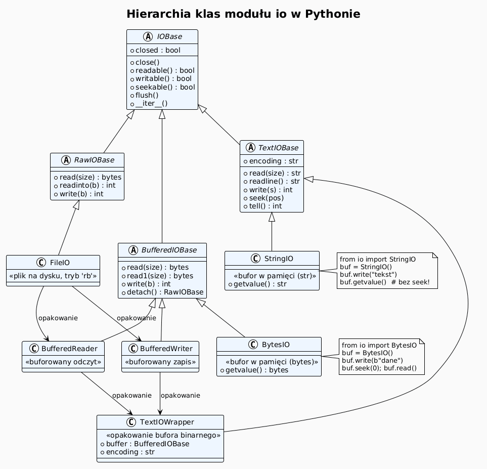
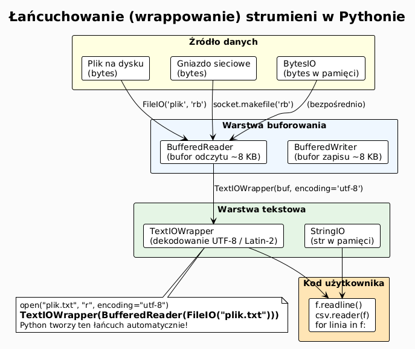
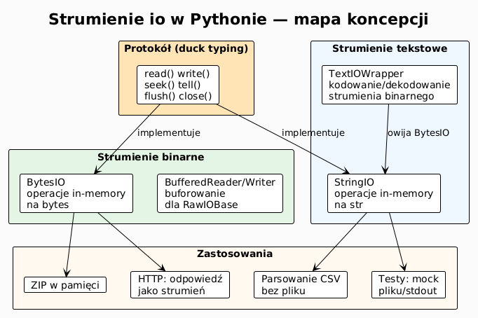

# 04 – Strumienie io: StringIO, BytesIO, wrappery

## Cel

Zrozumieć abstrakcję strumienia w Pythonie, poznać klasy `StringIO` i `BytesIO`
do operacji in-memory (bez pliku na dysku) oraz nauczyć się budować wrappery
i łańcuchy strumieni.

---

## 1. Czym jest strumień?

**Strumień** (ang. *stream*) to jednolity interfejs do sekwencyjnego odczytu
lub zapisu danych — niezależnie od źródła (plik, sieć, pamięć, stdin/stdout).

```
Producent danych  →  Strumień  →  Konsument danych
  (plik, sieć,         (io)         (kod, plik,
   generatory)                       sieć, ekran)
```

Python unifikuje ten interfejs przez moduł `io`. Każdy obiekt spełniający
protokół strumienia udostępnia metody: `read()`, `write()`, `seek()`, `tell()`,
`readline()`, `close()`.

---

## 2. Hierarchia klas `io`

| Klasa | Opis | Typ danych |
|-------|------|-----------|
| `RawIOBase` | surowy odczyt/zapis bajtów (np. `FileIO`) | `bytes` |
| `BufferedIOBase` | buforowane I/O (np. `BufferedReader`, `BytesIO`) | `bytes` |
| `TextIOBase` | tekstowe I/O z kodowaniem (np. `TextIOWrapper`, `StringIO`) | `str` |

### Diagram: hierarchia klas io



---

## 3. `StringIO` — strumień tekstowy in-memory

`StringIO` zachowuje się jak otwarty plik tekstowy, ale trzyma dane w pamięci.
Przydatny do testów, bufferowania i manipulacji ciągami jak plikami.

```python
from io import StringIO

# Zapis do bufora
buf = StringIO()
buf.write("Pierwsza linia\n")
buf.write("Druga linia\n")

# Odczyt od początku
buf.seek(0)
print(buf.read())

# Inicjalizacja z gotowym tekstem
src = StringIO("aaa\nbbb\nccc\n")
for linia in src:
    print(linia.rstrip())

# Pobierz całą zawartość bez seek
buf2 = StringIO()
buf2.write("dane")
print(buf2.getvalue())   # "dane" — nie wymaga seek(0)
```

### Zastosowania `StringIO`

```python
import csv
from io import StringIO

# Parsowanie CSV z ciągu znaków (zamiast z pliku)
csv_data = "imie,ocena\nAnna,5\nPiotr,4\n"
reader = csv.DictReader(StringIO(csv_data))
for row in reader:
    print(row)

# Generowanie CSV do zmiennej
out = StringIO()
writer = csv.writer(out)
writer.writerow(["x", "y"])
writer.writerow([1, 2])
csv_string = out.getvalue()
print(csv_string)
```

---

## 4. `BytesIO` — strumień binarny in-memory

`BytesIO` to binarny odpowiednik `StringIO`. Idealny do operacji na plikach
binarnych w pamięci: tworzenie obrazów, pakowanie danych, testy.

```python
from io import BytesIO
import struct

# Budowanie binarnego bufora
buf = BytesIO()
buf.write(b"MAGIC")
buf.write(struct.pack("<I", 42))
buf.write(b"\x00" * 8)

print(buf.tell())          # 17 — aktualna pozycja
print(buf.getvalue().hex())

# Czytanie z gotowego bufora
buf.seek(0)
magic = buf.read(5)
(liczba,) = struct.unpack("<I", buf.read(4))
print(magic, liczba)       # b'MAGIC' 42
```

### Zastosowania `BytesIO`

```python
from io import BytesIO
from PIL import Image  # pip install Pillow — przykładowo

# Typowy wzorzec: tworzenie pliku w pamięci
buf = BytesIO()
# img.save(buf, format="PNG")      # zapis do bufora zamiast pliku
buf.seek(0)
# dane = buf.read()                 # bajty PNG do przesłania HTTP lub bazy danych

# Testowanie funkcji operujących na strumieniu
def przetworz_strumien(strumien) -> bytes:
    """Funkcja akceptująca dowolny strumień binarny."""
    return strumien.read()

dane = b"\x01\x02\x03"
assert przetworz_strumien(BytesIO(dane)) == dane
```

---

## 5. Wrappery — łańcuchowanie strumieni

`io.TextIOWrapper` owija strumień binarny w strumień tekstowy,
dodając kodowanie i obsługę końca linii.

```python
from io import BytesIO, TextIOWrapper

# Binarny bufor + opakowanie tekstowe
raw = BytesIO()
txt = TextIOWrapper(raw, encoding="utf-8", newline="\n")

txt.write("Ala ma kota\n")
txt.write("Zażółć gęślą jaźń\n")
txt.flush()           # wymagane — TextIOWrapper ma własny bufor

raw.seek(0)
print(raw.read())     # bajty UTF-8
```

### Przechwytywanie stdout

```python
import sys
from io import StringIO

def przechwyc_stdout(func, *args, **kwargs):
    """Uruchamia funkcję i przechwytuje jej stdout."""
    stary = sys.stdout
    sys.stdout = bufor = StringIO()
    try:
        func(*args, **kwargs)
        return bufor.getvalue()
    finally:
        sys.stdout = stary

wydruk = przechwyc_stdout(print, "Witaj", "Świecie!")
print(f"Przechwycono: {wydruk!r}")
```

### Diagram: wrappery strumieni



---

## 6. Protokół strumienia — duck typing

Python nie wymaga dziedziczenia po `io.IOBase`. Wystarczy zaimplementować
odpowiednie metody:

```python
class EchoStream:
    """Strumień wypisujący każdy zapisywany bajt na ekran."""

    def __init__(self):
        self._buf = bytearray()

    def write(self, dane: bytes) -> int:
        for b in dane:
            print(f"  bajt: 0x{b:02x} = {chr(b) if 32<=b<127 else '?'}")
        self._buf.extend(dane)
        return len(dane)

    def read(self) -> bytes:
        return bytes(self._buf)

    def flush(self) -> None:
        pass

echo = EchoStream()
echo.write(b"Hi!")
```

---

## 7. `io.BufferedReader` i `io.BufferedWriter` — buforowanie ręczne

```python
from io import RawIOBase, BufferedReader, BufferedWriter, BytesIO

# Buforowany odczyt z dowolnego RawIOBase
# (zwykle używany z FileIO, ale pokazuje ideę)
raw = BytesIO(b"A" * 1000)
# BufferedReader(raw, buffer_size=256)   # bufor 256 B
```

---

## 8. Mini-lab: in-memory ZIP

Tworzenie archiwum ZIP w pamięci i przekazanie go jako `bytes`:

```python
import zipfile
from io import BytesIO

def stworz_zip_w_pamieci(pliki: dict[str, bytes]) -> bytes:
    """Tworzy archiwum ZIP w pamięci i zwraca bytes."""
    buf = BytesIO()
    with zipfile.ZipFile(buf, "w", zipfile.ZIP_DEFLATED) as zf:
        for nazwa, dane in pliki.items():
            zf.writestr(nazwa, dane)
    return buf.getvalue()

archiwum = stworz_zip_w_pamieci({
    "readme.txt": b"Opis projektu\n",
    "data.csv":   b"x,y\n1,2\n3,4\n",
})
print(f"ZIP w pamięci: {len(archiwum)} bajtów")

# Odczyt z pamięci
with zipfile.ZipFile(BytesIO(archiwum)) as zf:
    print("Zawartość:", zf.namelist())
    print(zf.read("readme.txt"))
```

---

## 9. Diagram: temat 04



---

## 10. Pytania kontrolne

1. Jakie metody musi mieć obiekt, żeby działać jak strumień tekstowy?
2. Kiedy użyć `StringIO` zamiast zwykłego stringa?
3. Jaka jest różnica między `buf.read()` po `buf.write()` a `buf.getvalue()`?
4. Do czego służy `TextIOWrapper`? Podaj przykład zastosowania.
5. Jak przechwycić wynik `print()` do zmiennej?
6. Co robi `buf.seek(0)`? Co się stanie, jeśli pominiesz ten krok?

---

## 11. Zadania

Zadania i rozwiązania: [exercises/](exercises/)

---

## 12. Literatura

- Python Docs – `io`: <https://docs.python.org/3/library/io.html>
- Python Docs – `zipfile`: <https://docs.python.org/3/library/zipfile.html>
- Python Docs – `csv`: <https://docs.python.org/3/library/csv.html>
- Real Python – *Python's io Module*: <https://realpython.com/python-io-tools/>
- D. Beazley & B. Jones, *Python Cookbook*, rozdz. 5 recepty 5.1–5.6.

