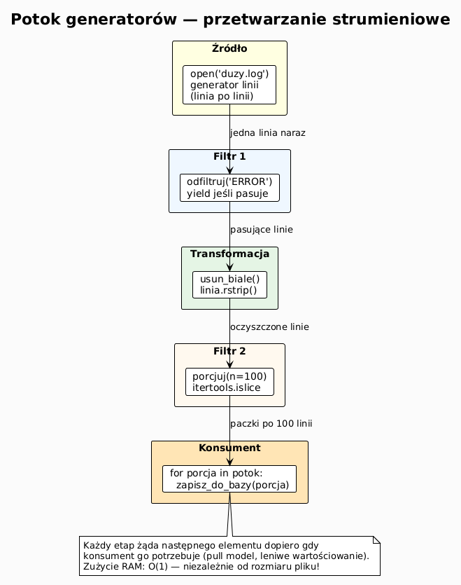
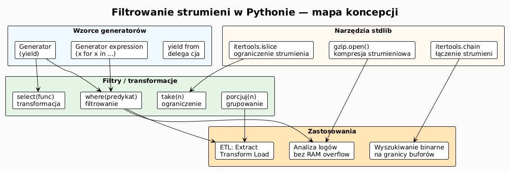

# 05 – Filtrowanie strumieni: generatory, potoki, duże pliki

## Cel

Zrozumieć wzorzec potoku przetwarzania danych (ang. *pipeline*) z generatorami
jako efektywnymi filtrami strumieni. Nauczyć się przetwarzać pliki większe
niż dostępna RAM bez wczytywania ich w całości.

---

## 1. Problem z dużymi plikami

```python
# Naiwne podejście — ŹLE dla 10 GB pliku!
with open("duzy.log", "r", encoding="utf-8") as f:
    linie = f.readlines()   # wczytuje CAŁY plik do pamięci RAM
    bledy = [l for l in linie if "ERROR" in l]
```

Plik 10 GB → zużycie RAM ≥ 10 GB. Program się wysypie lub zablokuje system.

```python
# Poprawne podejście — generator leniwy
with open("duzy.log", "r", encoding="utf-8") as f:
    bledy = (l for l in f if "ERROR" in l)
    for blad in bledy:
        print(blad)   # przetwarza jedną linię naraz
```

Zużycie RAM: **stałe** niezależnie od rozmiaru pliku.

---

## 2. Generator jako filtr

Generatory to funkcje zwracające wartości **leniwie** (ang. *lazy evaluation*).
Kiedy łączymy je w łańcuch, tworzymy potok przetwarzania — dane przepływają
element po elemencie, bez buforowania całości.

```python
def czytaj_linie(sciezka: str):
    """Źródło: generator linii pliku."""
    with open(sciezka, encoding="utf-8") as f:
        yield from f

def odfiltruj(linie, fraza: str):
    """Filtr: przepuszcza linie zawierające frazę."""
    for linia in linie:
        if fraza in linia:
            yield linia

def obetnij(linie, n: int):
    """Filtr: bierze pierwsze n linii."""
    for i, linia in enumerate(linie):
        if i >= n:
            return
        yield linia

def usun_biale(linie):
    """Transformacja: usuwa białe znaki z końca."""
    return (linia.rstrip() for linia in linie)
```

### Składanie potoku

```python
zrodlo  = czytaj_linie("app.log")
bledy   = odfiltruj(zrodlo, "ERROR")
pierwsze = obetnij(bledy, 10)
czyste  = usun_biale(pierwsze)

for linia in czyste:
    print(linia)
```

Dane przepływają **element po elemencie** — żaden etap nie widzi całego pliku naraz.

### Diagram: potok generatorów



---

## 3. Dekorator `@pipe` — komponowanie filtrów

```python
from functools import wraps
from typing import Iterable, Callable, TypeVar

T = TypeVar("T")

def filtr(func: Callable) -> Callable:
    """Dekorator zamieniający funkcję w komponentowy filtr potoku."""
    @wraps(func)
    def wrapper(*args, **kwargs):
        def _apply(iterable):
            return func(iterable, *args, **kwargs)
        return _apply
    return wrapper

@filtr
def where(iterable, predykat):
    return (x for x in iterable if predykat(x))

@filtr
def select(iterable, func):
    return (func(x) for x in iterable)

@filtr
def take(iterable, n):
    for i, x in enumerate(iterable):
        if i >= n: return
        yield x

# Użycie
linie = open("app.log", encoding="utf-8")
wynik = take(10)(where(lambda l: "ERROR" in l)(linie))
```

---

## 4. Wzorzec producent–konsument z `itertools`

```python
import itertools

def porcjuj(iterable, n: int):
    """Dzieli strumień na porcje (chunks) po n elementów."""
    it = iter(iterable)
    while True:
        porcja = list(itertools.islice(it, n))
        if not porcja:
            return
        yield porcja

# Przetwarzanie 1 000 000 linii po 1000 naraz
with open("milion.log", encoding="utf-8") as f:
    for porcja in porcjuj(f, 1000):
        # Przetworz 1000 linii naraz (np. zapis do bazy)
        print(f"Przetwarzam porcję {len(porcja)} linii")
```

---

## 5. Przetwarzanie strumieniowe pliku CSV

```python
import csv
from pathlib import Path

def wiersze_csv(sciezka: Path):
    """Generator wierszy CSV (słowniki)."""
    with sciezka.open(encoding="utf-8") as f:
        yield from csv.DictReader(f)

def filtruj_po_polu(wiersze, pole: str, wartosc: str):
    return (w for w in wiersze if w.get(pole) == wartosc)

def konwertuj_typ(wiersze, pole: str, typ):
    for w in wiersze:
        w[pole] = typ(w[pole])
        yield w

# Przykład: 1 GB pliku CSV — przetwarzanie strumieniowe
pipeline = filtruj_po_polu(
    konwertuj_typ(wiersze_csv(Path("sprzedaz.csv")), "kwota", float),
    "miasto", "Kraków"
)
suma = sum(w["kwota"] for w in pipeline)
print(f"Suma sprzedaży w Krakowie: {suma:.2f} PLN")
```

---

## 6. Filtrowanie binarne — wyszukiwanie wzorca w strumieniu

```python
def szukaj_w_strumieniu(strumien, wzorzec: bytes, buf_size: int = 65_536):
    """Szuka wzorca w strumieniu binarnym, obsługując granice buforów."""
    overlap = len(wzorzec) - 1
    offset  = 0
    poprzedni = b""
    while True:
        blok = strumien.read(buf_size)
        if not blok:
            break
        dane = poprzedni + blok
        pos = 0
        while True:
            idx = dane.find(wzorzec, pos)
            if idx == -1:
                break
            yield offset - len(poprzedni) + idx
            pos = idx + 1
        poprzedni = dane[-overlap:] if overlap else b""
        offset += len(blok)
```

---

## 7. Transformacja i kompresja strumieniowa

```python
import gzip
from pathlib import Path

def kompresuj_strumieniowo(zrodlo: Path, cel: Path, chunk: int = 65_536) -> int:
    """Kompresuje plik strumieniowo gzip. Zwraca rozmiar wynikowy."""
    z = 0
    with zrodlo.open("rb") as src, gzip.open(cel, "wb") as dst:
        for blok in iter(lambda: src.read(chunk), b""):
            dst.write(blok)
            z += len(blok)
    return z

# Kompresja 10 GB pliku → stałe zużycie RAM ~64 KB
n = kompresuj_strumieniowo(Path("duzy.log"), Path("duzy.log.gz"))
print(f"Skompresowano {n} bajtów")
```

---

## 8. Mini-lab: analiza logów bez wczytywania do pamięci

### Krok 1 — wygeneruj plik logów

```python
from pathlib import Path
import random

def generuj_logi(sciezka: Path, n: int = 100_000) -> None:
    poziomy = ["INFO", "WARNING", "ERROR", "DEBUG"]
    wagi    = [0.7, 0.15, 0.1, 0.05]
    with sciezka.open("w", encoding="utf-8") as f:
        for i in range(n):
            poz = random.choices(poziomy, wagi)[0]
            f.write(f"2024-01-{i%28+1:02d} {poz} Zdarzenie nr {i}\n")
```

### Krok 2 — statystyki strumieniowo

```python
from collections import Counter

def statystyki_logow(sciezka: Path) -> Counter:
    with sciezka.open(encoding="utf-8") as f:
        return Counter(
            linia.split()[1]   # drugi token = poziom
            for linia in f
            if linia.strip()
        )

stats = statystyki_logow(Path("app.log"))
print(stats)  # Counter({'INFO': 70023, 'WARNING': 14987, ...})
```

### Krok 3 — eksport błędów do nowego pliku

```python
def eksportuj_bledy(zrodlo: Path, cel: Path) -> int:
    licznik = 0
    with zrodlo.open(encoding="utf-8") as src, cel.open("w", encoding="utf-8") as dst:
        for linia in src:
            if " ERROR " in linia:
                dst.write(linia)
                licznik += 1
    return licznik
```

---

## 9. Diagram: temat 05



---

## 10. Pytania kontrolne

1. Dlaczego generator zużywa stałą ilość pamięci niezależnie od rozmiaru pliku?
2. Co to jest „leniwe wartościowanie" (lazy evaluation)?
3. Jak `itertools.islice` pomaga przy przetwarzaniu strumieni?
4. Czym różni się `(x for x in lst)` od `[x for x in lst]`?
5. Jak bezpiecznie szukać wzorca binarnego na granicy dwóch bloków?
6. Kiedy warto użyć `gzip.open()` zamiast zwykłego `open()`?

---

## 11. Zadania

Zadania i rozwiązania: [exercises/](exercises/)

---

## 12. Literatura

- Python Docs – Generatory: <https://docs.python.org/3/glossary.html#term-generator>
- Python Docs – `itertools`: <https://docs.python.org/3/library/itertools.html>
- Python Docs – `gzip`: <https://docs.python.org/3/library/gzip.html>
- D. Beazley – *Generator Tricks for Systems Programmers* (PyCon 2008): <https://www.dabeaz.com/generators/>
- D. Beazley – *Generators: The Final Frontier* (PyCon 2014): <https://www.dabeaz.com/finalgenerator/>
- Real Python – *How to Use Generators and yield in Python*: <https://realpython.com/introduction-to-python-generators/>
- D. Beazley & B. Jones, *Python Cookbook*, rozdz. 4 „Iterators and Generators".

