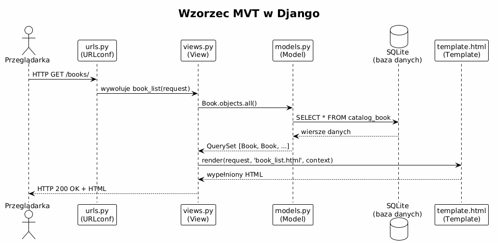
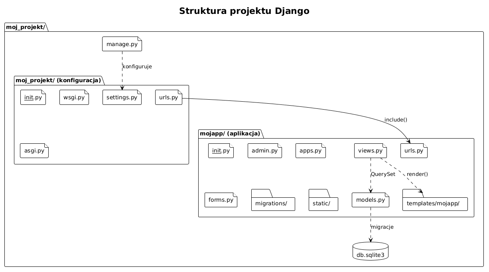
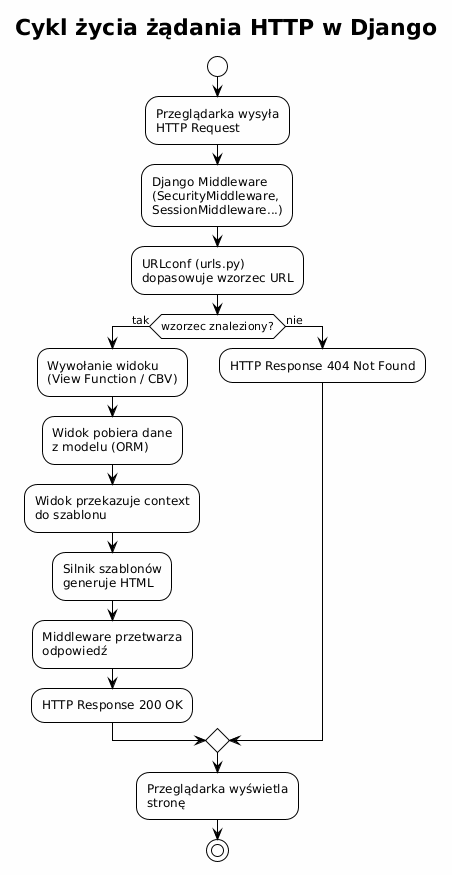

# Temat 01 – Wprowadzenie do Django: MVT, instalacja, pierwszy projekt

## Czym jest framework webowy?

Kiedy piszesz aplikację webową od zera, musisz samodzielnie rozwiązać wiele powtarzających się
problemów: jak odebrać żądanie HTTP, jak dopasować URL do funkcji, jak połączyć się z bazą danych,
jak wygenerować HTML, jak zarządzać sesjami użytkowników. **Framework webowy** to gotowa biblioteka
(lub zestaw bibliotek), która rozwiązuje te problemy i pozwala skupić się na logice biznesowej
aplikacji.

### Popularne frameworki Python

| Framework | Charakter | Zastosowanie |
|-----------|-----------|--------------|
| **Django** | Full-stack, „bateryjny" | Duże portale, CMS, API REST |
| **Flask** | Mikro-framework | Małe API, prototypy |
| **FastAPI** | Nowoczesne API | Mikroserwisy, async, REST/OpenAPI |
| **Tornado** | Asynchroniczny | Wysoka współbieżność, WebSocket |

Django jest wyborem numer jeden dla osób, które chcą nauczyć się tworzenia aplikacji webowych
w Pythonie – ma ogromną społeczność, doskonałą dokumentację i filozofię
„batteries included" (bateryjny).

---

## Wzorzec MVT – Model-View-Template

Django stosuje wzorzec architektoniczny **MVT**, będący wariantem klasycznego MVC
(Model-View-Controller). Różnica polega na tym, że rolę kontrolera przejmuje sam Django
(dispatcher URL + middleware), a programista pisze tylko trzy warstwy:

```
┌─────────┐    ┌──────────────────────────────────────────┐
│         │    │                  Django                   │
│  Przegl.│    │  ┌────────┐   ┌────────┐   ┌──────────┐  │
│ ądarka  │◄───┤  │Template│◄──│  View  │──►│  Model   │  │
│         │───►│  │ (HTML) │   │(views) │   │(models)  │  │
└─────────┘    │  └────────┘   └────────┘   └────┬─────┘  │
               │                                  │        │
               │                            ┌─────▼─────┐  │
               │                            │  SQLite   │  │
               │                            │  / ORM    │  │
               └────────────────────────────┴───────────┘  │
```

| Warstwa | Odpowiada za | Pliki |
|---------|-------------|-------|
| **Model** | Dane i logika biznesowa | `models.py` |
| **View** | Przetwarzanie żądania, wywołanie modelu | `views.py` |
| **Template** | Prezentacja danych w HTML | `templates/*.html` |

### Diagram sekwencji żądania HTTP



Kroki obsługi żądania `GET /books/`:

1. Przeglądarka wysyła żądanie HTTP do serwera Django.
2. Django sprawdza plik `urls.py` i dopasowuje wzorzec `/books/` do funkcji `book_list`.
3. Widok `book_list` wywołuje `Book.objects.all()` – ORM Django generuje zapytanie SQL.
4. Wynik (lista obiektów `Book`) jest przekazywany do szablonu HTML jako kontekst.
5. Szablon generuje HTML z danymi i Django odsyła odpowiedź do przeglądarki.

---

## Instalacja Django

### Środowisko wirtualne (zalecane!)

```bash
# Tworzenie środowiska wirtualnego
python -m venv venv

# Aktywacja (Linux/macOS)
source venv/bin/activate

# Aktywacja (Windows PowerShell)
.\venv\Scripts\Activate.ps1

# Instalacja Django
pip install django

# Sprawdzenie wersji
python -m django --version
# -> 5.x.x  (lub 4.2.x)
```

> **Ważne:** Zawsze instaluj Django w izolowanym środowisku wirtualnym.
> Instalacja globalna może prowadzić do konfliktów wersji między projektami.

---

## Tworzenie projektu i aplikacji

Django rozróżnia dwa pojęcia: **projekt** (cała konfiguracja) i **aplikacja** (moduł funkcjonalny).
Jeden projekt może zawierać wiele aplikacji.

```bash
# Tworzenie projektu
django-admin startproject bookshelf .
# Kropka na końcu tworzy projekt w bieżącym katalogu (bez zagnieżdżenia)

# Tworzenie aplikacji wewnątrz projektu
python manage.py startapp catalog
```

Po wykonaniu tych poleceń powstaje struktura:

```
bookshelf/          ← katalog projektu (konfiguracja)
├── __init__.py
├── settings.py     ← konfiguracja: baza, aplikacje, szablony...
├── urls.py         ← główna tablica URL
├── wsgi.py         ← punkt wejścia WSGI (prod)
└── asgi.py         ← punkt wejścia ASGI (async)
catalog/            ← aplikacja
├── __init__.py
├── admin.py        ← rejestracja modeli w panelu admina
├── apps.py         ← konfiguracja aplikacji
├── models.py       ← definicje tabel (klas modeli)
├── views.py        ← logika widoków
├── urls.py         ← URL-e aplikacji (tworzymy ręcznie)
└── migrations/     ← historia migracji bazy
manage.py           ← narzędzie zarządzania projektem
db.sqlite3          ← baza danych (powstaje po migrate)
```



---

## Rejestracja aplikacji w projekcie

Po stworzeniu aplikacji trzeba ją zarejestrować w `settings.py`:

```python
# bookshelf/settings.py
INSTALLED_APPS = [
    'django.contrib.admin',
    'django.contrib.auth',
    'django.contrib.contenttypes',
    'django.contrib.sessions',
    'django.contrib.messages',
    'django.contrib.staticfiles',
    'catalog',           # ← nasza aplikacja
]
```

---

## Minimalna aplikacja „Hello, Django!"

### Krok 1 – widok (views.py)

```python
# catalog/views.py
from django.http import HttpResponse

def hello(request):
    return HttpResponse("<h1>Witaj w Django!</h1>")
```

### Krok 2 – URL aplikacji (catalog/urls.py)

```python
# catalog/urls.py
from django.urls import path
from . import views

urlpatterns = [
    path('hello/', views.hello, name='hello'),
]
```

### Krok 3 – URL projektu (bookshelf/urls.py)

```python
# bookshelf/urls.py
from django.contrib import admin
from django.urls import path, include

urlpatterns = [
    path('admin/', admin.site.urls),
    path('', include('catalog.urls')),   # ← dołączamy URL-e aplikacji
]
```

### Krok 4 – uruchomienie

```bash
python manage.py migrate        # tworzy db.sqlite3 z domyślnymi tabelami
python manage.py runserver      # startuje serwer deweloperski
# Otwórz: http://127.0.0.1:8000/hello/
```

---

## Cykl życia żądania HTTP



Każde żądanie przechodzi przez stos **middleware** (np. sprawdzenie sesji, nagłówki bezpieczeństwa)
zanim dotrze do widoku i po wyjściu z widoku.

---

## Konfiguracja bazy danych (settings.py)

Django domyślnie konfiguruje SQLite – idealny wybór na etapie nauki:

```python
# bookshelf/settings.py
DATABASES = {
    'default': {
        'ENGINE': 'django.db.backends.sqlite3',
        'NAME': BASE_DIR / 'db.sqlite3',
    }
}
```

Zmiana na PostgreSQL to tylko edycja tego słownika (i `pip install psycopg2`).

---

## Konfiguracja szablonów

```python
# bookshelf/settings.py
TEMPLATES = [
    {
        'BACKEND': 'django.template.backends.django.DjangoTemplates',
        'DIRS': [BASE_DIR / 'templates'],   # ← globalne szablony projektu
        'APP_DIRS': True,  # ← szablony w catalog/templates/
        'OPTIONS': { ... },
    },
]
```

Z `APP_DIRS: True` Django automatycznie szuka szablonów w `<app>/templates/`.

---

## Polecenia manage.py – najważniejsze

| Polecenie | Działanie |
|-----------|-----------|
| `python manage.py runserver` | Serwer deweloperski |
| `python manage.py migrate` | Wykonaj migracje bazy |
| `python manage.py makemigrations` | Wykryj zmiany modeli i utwórz migracje |
| `python manage.py createsuperuser` | Utwórz konto admina |
| `python manage.py shell` | Interaktywna konsola z kontekstem Django |
| `python manage.py startapp <name>` | Utwórz nową aplikację |
| `python manage.py test` | Uruchom testy |
| `python manage.py collectstatic` | Zbierz pliki statyczne (prod) |

---

## Mini-lab: pierwszy projekt

1. Utwórz wirtualne środowisko i zainstaluj Django.
2. Wykonaj `django-admin startproject moj_blog .` i `python manage.py startapp posts`.
3. Zarejestruj `posts` w `INSTALLED_APPS`.
4. Napisz widok zwracający `HttpResponse("Mój pierwszy blog!")`.
5. Podłącz widok do URL `/`.
6. Uruchom serwer i otwórz stronę.
7. Sprawdź panel admina pod `/admin/` (po `createsuperuser`).

---

## Pytania kontrolne

1. Czym różni się projekt od aplikacji w Django?
2. Jaką rolę pełni plik `urls.py`?
3. Co robi polecenie `python manage.py migrate`?
4. Dlaczego warto używać środowisk wirtualnych?
5. Opisz kroki, przez które przechodzi żądanie HTTP w Django.
6. Jakie są trzy warstwy wzorca MVT?

---

## Literatura

- Django Tutorial (oficjalny, część 1): <https://docs.djangoproject.com/en/stable/intro/tutorial01/>
- Django „Writing your first Django app": <https://docs.djangoproject.com/en/stable/intro/overview/>
- MDN – Django Web Framework: <https://developer.mozilla.org/en-US/docs/Learn/Server-side/Django/Introduction>
- W. S. Vincent, *Django for Beginners*, rozdz. 1-2: <https://djangoforbeginners.com/>
- Real Python – *Get Started With Django*: <https://realpython.com/get-started-with-django-1/>

