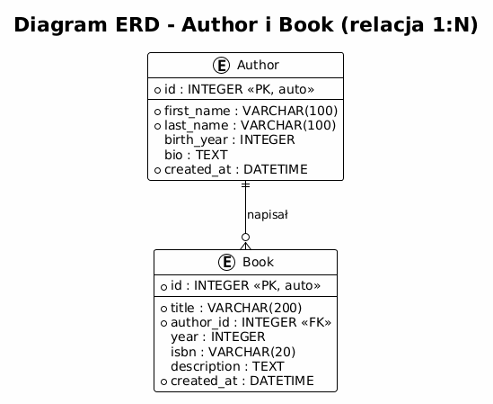
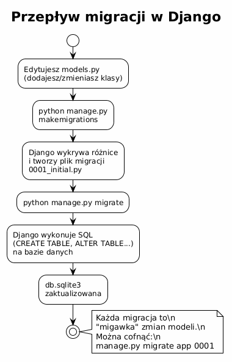
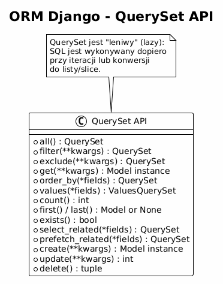

# Temat 02 – Modele i ORM: definicja, migracje, zapytania

## Czym jest model w Django?

**Model** to klasa Pythona dziedzicząca po `django.db.models.Model`, która opisuje strukturę
jednej tabeli bazy danych. Każde pole klasy odpowiada kolumnie w tabeli.
Django automatycznie generuje polecenia SQL na podstawie definicji klas – to właśnie
**ORM** (Object-Relational Mapping).

Zalety ORM:
- Piszesz kod Python, a nie SQL (choć SQL też możliwy).
- Niezależność od silnika bazy (SQLite, PostgreSQL, MySQL, Oracle).
- Automatyczne ucieczki od SQL Injection.
- Wygodna nawigacja po relacjach.

---

## Definicja modeli – przykład

Aplikacja będzie przechowywać **autorów** i ich **książki** (relacja 1:N – jeden autor, wiele książek).

```python
# catalog/models.py
from django.db import models


class Author(models.Model):
    """Autor książki."""
    first_name = models.CharField(max_length=100, verbose_name="Imię")
    last_name  = models.CharField(max_length=100, verbose_name="Nazwisko")
    birth_year = models.IntegerField(null=True, blank=True,
                                     verbose_name="Rok urodzenia")
    bio        = models.TextField(blank=True, verbose_name="Biogram")
    created_at = models.DateTimeField(auto_now_add=True)

    class Meta:
        ordering = ['last_name', 'first_name']
        verbose_name = "Autor"
        verbose_name_plural = "Autorzy"

    def __str__(self):
        return f"{self.first_name} {self.last_name}"

    def full_name(self):
        return f"{self.first_name} {self.last_name}"


class Book(models.Model):
    """Książka powiązana z autorem."""
    title       = models.CharField(max_length=200, verbose_name="Tytuł")
    author      = models.ForeignKey(
        Author,
        on_delete=models.CASCADE,       # usuń książki gdy usunięty autor
        related_name='books',           # author.books.all()
        verbose_name="Autor",
    )
    year        = models.IntegerField(null=True, blank=True,
                                      verbose_name="Rok wydania")
    isbn        = models.CharField(max_length=20, blank=True,
                                   verbose_name="ISBN")
    description = models.TextField(blank=True, verbose_name="Opis")
    created_at  = models.DateTimeField(auto_now_add=True)

    class Meta:
        ordering = ['title']
        verbose_name = "Książka"
        verbose_name_plural = "Książki"

    def __str__(self):
        return f"{self.title} ({self.author})"
```

### Diagram ERD



---

## Typy pól modelu – najważniejsze

| Typ pola | Python / SQL | Uwagi |
|----------|-------------|-------|
| `CharField(max_length=N)` | str / VARCHAR | Wymagane max_length |
| `TextField()` | str / TEXT | Długi tekst, bez limitu |
| `IntegerField()` | int / INTEGER | Liczba całkowita |
| `FloatField()` | float / REAL | Liczba zmiennoprzecinkowa |
| `DecimalField(max_digits, decimal_places)` | Decimal / NUMERIC | Finanse |
| `BooleanField()` | bool / BOOLEAN | True/False |
| `DateField()` | date / DATE | Data (bez czasu) |
| `DateTimeField()` | datetime / DATETIME | Data i czas |
| `EmailField()` | str / VARCHAR | Waliduje format e-mail |
| `URLField()` | str / VARCHAR | Waliduje URL |
| `ForeignKey(Model, on_delete=...)` | int / INTEGER FK | Relacja N:1 |
| `ManyToManyField(Model)` | – / tabela pośrednia | Relacja M:N |
| `OneToOneField(Model, on_delete=...)` | int / INTEGER FK UNIQUE | Relacja 1:1 |

### Opcje pól

```python
field = models.CharField(
    max_length=100,
    null=True,       # kolumna może być NULL w bazie
    blank=True,      # pole może być puste w formularzu
    default="brak",  # wartość domyślna
    unique=True,     # wartość musi być unikalna w tabeli
    verbose_name="Tytuł",  # etykieta w panelu admina i formularzach
)
```

> **Uwaga:** `null=True` dotyczy bazy danych, `blank=True` dotyczy walidacji formularzy.
> Dla pól tekstowych lepiej stosować `blank=True` bez `null=True` – pusty string jest
> czytelniejszy niż NULL.

---

## Relacja ForeignKey – szczegóły

```python
author = models.ForeignKey(
    Author,
    on_delete=models.CASCADE,   # co zrobić z książkami po usunięciu autora?
    related_name='books',        # dostęp odwrotny: author.books.all()
)
```

### Opcje `on_delete`

| Opcja | Zachowanie |
|-------|-----------|
| `CASCADE` | Usuń obiekty powiązane |
| `PROTECT` | Zablokuj usunięcie (wyjątek `ProtectedError`) |
| `SET_NULL` | Ustaw pole FK na NULL (wymaga `null=True`) |
| `SET_DEFAULT` | Ustaw wartość domyślną |
| `DO_NOTHING` | Nic nie rób (ryzyko naruszenia integralności) |

---

## Migracje

Migracje to mechanizm śledzenia zmian schematu bazy danych.

```bash
# Wykryj zmiany w models.py i utwórz plik migracji
python manage.py makemigrations catalog

# Podejrzyj SQL, który zostanie wykonany
python manage.py sqlmigrate catalog 0001

# Wykonaj migracje
python manage.py migrate

# Historia migracji
python manage.py showmigrations
```

### Przykładowy plik migracji

```python
# catalog/migrations/0001_initial.py
from django.db import migrations, models
import django.db.models.deletion

class Migration(migrations.Migration):
    initial = True
    dependencies = []

    operations = [
        migrations.CreateModel(
            name='Author',
            fields=[
                ('id', models.BigAutoField(auto_created=True, primary_key=True)),
                ('first_name', models.CharField(max_length=100, verbose_name='Imię')),
                ('last_name', models.CharField(max_length=100, verbose_name='Nazwisko')),
                ('birth_year', models.IntegerField(blank=True, null=True)),
                ('bio', models.TextField(blank=True)),
                ('created_at', models.DateTimeField(auto_now_add=True)),
            ],
            options={'ordering': ['last_name', 'first_name']},
        ),
        migrations.CreateModel(
            name='Book',
            fields=[
                ('id', models.BigAutoField(auto_created=True, primary_key=True)),
                ('title', models.CharField(max_length=200)),
                ('author', models.ForeignKey(
                    on_delete=django.db.models.deletion.CASCADE,
                    related_name='books',
                    to='catalog.author',
                )),
                ('year', models.IntegerField(blank=True, null=True)),
                ('isbn', models.CharField(blank=True, max_length=20)),
                ('description', models.TextField(blank=True)),
                ('created_at', models.DateTimeField(auto_now_add=True)),
            ],
            options={'ordering': ['title']},
        ),
    ]
```



---

## ORM – QuerySet API

Django ORM operuje na **QuerySet** – leniwym (lazy) zbiorze wyników zapytania.
SQL jest generowany dopiero przy pierwszej iteracji lub konwersji do listy.



### Tworzenie obiektów

```python
# Sposób 1 – create() (od razu zapisuje do bazy)
tolkien = Author.objects.create(
    first_name="J.R.R.",
    last_name="Tolkien",
    birth_year=1892,
    bio="Angielski pisarz i filolog.",
)

# Sposób 2 – instancja + save()
sapkowski = Author(first_name="Andrzej", last_name="Sapkowski")
sapkowski.save()

# Tworzenie książki (ForeignKey)
book = Book.objects.create(
    title="Władca Pierścieni",
    author=tolkien,
    year=1954,
    isbn="978-0-618-64015-7",
)
```

### Pobieranie obiektów

```python
# Wszystkie obiekty (lazy – SQL nie wykonany)
all_books = Book.objects.all()

# Jeden obiekt (wyjątek jeśli nie ma lub jest więcej niż jeden)
book = Book.objects.get(id=1)
book = Book.objects.get(isbn="978-0-618-64015-7")

# Pierwszy/ostatni
first = Book.objects.first()
last  = Book.objects.last()

# Filtrowanie – zwraca QuerySet
fantasy = Book.objects.filter(description__icontains="fantasy")
new_books = Book.objects.filter(year__gte=2000)

# Wykluczanie
not_tolkien = Book.objects.exclude(author__last_name="Tolkien")

# Sortowanie
by_year = Book.objects.order_by('-year')   # minus = malejąco

# Zliczanie
count = Book.objects.count()

# Sprawdzenie czy istnieje
exists = Book.objects.filter(isbn="xyz").exists()
```

### Lookups – operatory filtrowania

```python
# Porównania
Book.objects.filter(year=2000)          # dokładna równość
Book.objects.filter(year__gt=2000)      # year > 2000
Book.objects.filter(year__gte=2000)     # year >= 2000
Book.objects.filter(year__lt=2000)      # year < 2000
Book.objects.filter(year__lte=2000)     # year <= 2000
Book.objects.filter(year__in=[1954, 1955, 1956])  # IN (...)

# Napisy
Book.objects.filter(title__contains="Ring")     # LIKE '%Ring%'
Book.objects.filter(title__icontains="ring")    # case-insensitive
Book.objects.filter(title__startswith="Władca")
Book.objects.filter(title__endswith="Pierścieni")

# NULL
Author.objects.filter(birth_year__isnull=True)

# Relacje (podkreślnik podwójny = przejście przez FK)
Book.objects.filter(author__last_name="Tolkien")
Book.objects.filter(author__birth_year__gte=1900)
```

### Aktualizacja i usuwanie

```python
# Aktualizacja jednego obiektu
book = Book.objects.get(id=1)
book.year = 1955
book.save()                   # zapisuje wszystkie pola

# Aktualizacja wielu obiektów (jeden SQL UPDATE)
Book.objects.filter(year=None).update(year=2000)

# Usunięcie jednego obiektu
book.delete()

# Usunięcie wielu (UWAGA: CASCADE działa)
Book.objects.filter(year__lt=1900).delete()
```

### Nawigacja po relacjach

```python
# Dostęp do obiektu FK (z autora do książek)
tolkien = Author.objects.get(last_name="Tolkien")
for book in tolkien.books.all():    # related_name='books'
    print(book.title)

# Dostęp do autora z poziomu książki
book = Book.objects.get(id=1)
print(book.author.full_name())      # Author.full_name()

# select_related – pobiera FK w jednym SQL (JOIN)
books = Book.objects.select_related('author').all()
# Teraz book.author NIE wykonuje dodatkowego SQL
```

### Shell Django – testowanie ORM

```bash
python manage.py shell
```

```python
>>> from catalog.models import Author, Book
>>> Author.objects.create(first_name="Adam", last_name="Mickiewicz", birth_year=1798)
<Author: Adam Mickiewicz>
>>> Author.objects.count()
1
>>> Author.objects.filter(birth_year__lt=1900)
<QuerySet [<Author: Adam Mickiewicz>]>
```

---

## Klasa Meta modelu

```python
class Book(models.Model):
    ...
    class Meta:
        ordering = ['-year', 'title']   # domyślne sortowanie
        verbose_name = "Książka"        # nazwa w panelu admina
        verbose_name_plural = "Książki"
        unique_together = [['title', 'author']]  # unikalność kombinacji
        indexes = [
            models.Index(fields=['year']),       # indeks SQL
        ]
```

---

## Mini-lab: modele w praktyce

1. Stwórz projekt Django z aplikacją `catalog`.
2. Zdefiniuj modele `Author` i `Book` jak w przykładzie.
3. Uruchom `makemigrations` i `migrate`.
4. Otwórz `python manage.py shell` i:
   - Stwórz 2 autorów.
   - Stwórz po 2 książki dla każdego autora.
   - Pobierz wszystkie książki autora przez `author.books.all()`.
   - Filtruj książki wydane po 2000 roku.
   - Zaktualizuj biogram jednego autora.
   - Usuń jedną książkę i sprawdź, że powiązany autor nadal istnieje.

---

## Pytania kontrolne

1. Czym jest ORM i jakie daje korzyści?
2. Co to jest QuerySet i dlaczego jest „leniwy"?
3. Jaka jest różnica między `get()` a `filter()`?
4. Co oznacza parametr `on_delete=models.CASCADE`?
5. Jak za pomocą ORM pobrać wszystkie książki konkretnego autora?
6. Do czego służą migracje i dlaczego należy je wersjonować w repozytorium?

---

## Literatura

- Django Docs – Models: <https://docs.djangoproject.com/en/stable/topics/db/models/>
- Django Docs – Queries: <https://docs.djangoproject.com/en/stable/topics/db/queries/>
- Django Docs – QuerySet API: <https://docs.djangoproject.com/en/stable/ref/models/querysets/>
- Django Docs – Migrations: <https://docs.djangoproject.com/en/stable/topics/migrations/>
- Django Tutorial, część 2: <https://docs.djangoproject.com/en/stable/intro/tutorial02/>
- Real Python – *Django Models*: <https://realpython.com/get-started-with-django-1/>

