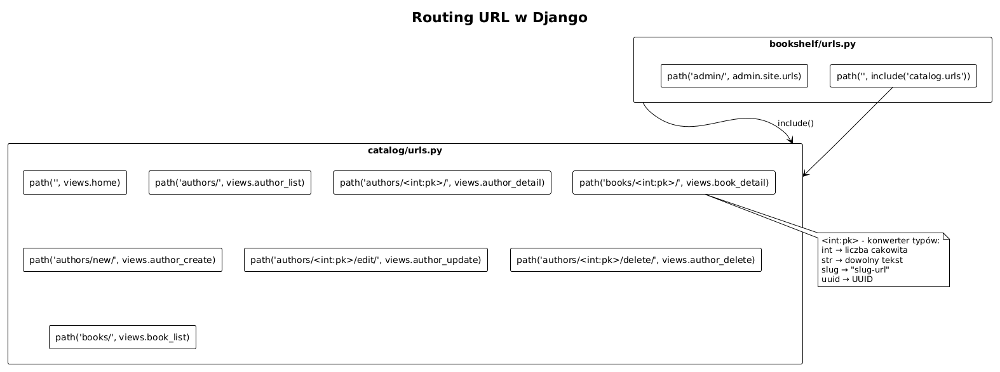
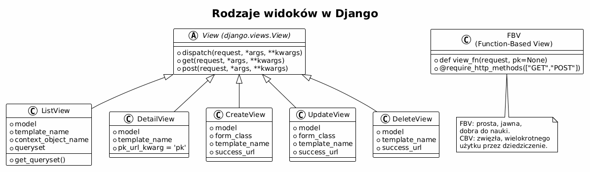

# Temat 03 – Widoki i URL-e: routing, widoki funkcyjne i klasowe

## Czym jest widok w Django?

**Widok (View)** to funkcja lub klasa Pythona, która:
1. Otrzymuje obiekt `HttpRequest` (żądanie HTTP),
2. Wykonuje logikę (pobiera dane z modelu, przetwarza formularz...),
3. Zwraca obiekt `HttpResponse` (odpowiedź HTTP – HTML, JSON, przekierowanie...).

```
Żądanie HTTP → View → HttpResponse
```

Django wspiera dwa style pisania widoków:
- **FBV (Function-Based Views)** – prosta funkcja Python,
- **CBV (Class-Based Views)** – klasa dziedzicząca z generycznych widoków Django.

---

## Routing URL – jak Django dopasowuje URL?

Kiedy przychodzi żądanie, Django przeszukuje plik `urls.py` od góry do dołu,
dopasowując wzorce za pomocą funkcji `path()` lub `re_path()`.

### Projekt główny (bookshelf/urls.py)

```python
from django.contrib import admin
from django.urls import path, include

urlpatterns = [
    path('admin/', admin.site.urls),
    path('', include('catalog.urls')),  # deleguj do aplikacji catalog
]
```

### Aplikacja (catalog/urls.py)

```python
from django.urls import path
from . import views

app_name = 'catalog'   # namespace – pozwala na 

urlpatterns = [
    path('',                         views.home,           name='home'),
    path('authors/',                 views.author_list,    name='author_list'),
    path('authors/<int:pk>/',        views.author_detail,  name='author_detail'),
    path('authors/new/',             views.author_create,  name='author_create'),
    path('authors/<int:pk>/edit/',   views.author_update,  name='author_update'),
    path('authors/<int:pk>/delete/', views.author_delete,  name='author_delete'),
    path('books/',                   views.book_list,      name='book_list'),
    path('books/<int:pk>/',          views.book_detail,    name='book_detail'),
    path('books/new/',               views.book_create,    name='book_create'),
    path('books/<int:pk>/edit/',     views.book_update,    name='book_update'),
    path('books/<int:pk>/delete/',   views.book_delete,    name='book_delete'),
]
```

### Konwertery typów w URL

```python
path('books/<int:pk>/', ...)     # int: tylko liczby, przekazuje int
path('articles/<slug:slug>/', ...)  # slug: litery, cyfry, myślniki
path('files/<path:filepath>/', ...)  # path: dowolna ścieżka (ze slashami)
path('users/<uuid:user_id>/', ...)  # uuid: UUID
```



### Odwrócone URL-e (reverse)

Nie wpisuj URL-i na sztywno – używaj nazw:

```python
# W widokach Pythona
from django.urls import reverse
from django.shortcuts import redirect

def some_view(request):
    return redirect(reverse('catalog:author_list'))
    # lub krócej:
    return redirect('catalog:author_list')

# Z parametrem
url = reverse('catalog:author_detail', kwargs={'pk': 42})
# -> '/authors/42/'
```

```html
<!-- W szablonach HTML -->
<a href="">Lista autorów</a>
<a href="">{{ author }}</a>
```

---

## Widoki funkcyjne (FBV)

### Widok tylko do odczytu

```python
# catalog/views.py
from django.shortcuts import render, get_object_or_404
from .models import Author, Book


def author_list(request):
    """Lista wszystkich autorów."""
    authors = Author.objects.all()
    return render(request, 'catalog/author_list.html', {
        'authors': authors,
        'title': 'Autorzy',
    })


def author_detail(request, pk):
    """Szczegóły jednego autora + jego książki."""
    author = get_object_or_404(Author, pk=pk)   # 404 jeśli nie ma
    books  = author.books.all()
    return render(request, 'catalog/author_detail.html', {
        'author': author,
        'books': books,
    })
```

### `get_object_or_404`

```python
# BEZ get_object_or_404 (więcej kodu)
try:
    author = Author.objects.get(pk=pk)
except Author.DoesNotExist:
    raise Http404("Autor nie istnieje")

# Z get_object_or_404 (idiomatyczne)
author = get_object_or_404(Author, pk=pk)
```

### Widok obsługujący GET i POST

```python
from django.shortcuts import render, redirect
from .forms import AuthorForm


def author_create(request):
    """Tworzenie nowego autora."""
    if request.method == 'POST':
        form = AuthorForm(request.POST)
        if form.is_valid():
            form.save()
            return redirect('catalog:author_list')
    else:
        form = AuthorForm()   # pusty formularz na GET

    return render(request, 'catalog/author_form.html', {
        'form': form,
        'title': 'Nowy autor',
    })
```

Schemat **POST-Redirect-GET** (PRG):
- `POST` – prześlij formularz,
- `Redirect` – po sukcesie przekieruj (zapobiega podwójnemu wysłaniu),
- `GET` – użytkownik widzi wynik.

---

## Widoki klasowe (CBV)

Django dostarcza gotowe klasy dla typowych operacji CRUD:

```python
from django.views.generic import (
    ListView, DetailView, CreateView, UpdateView, DeleteView
)
from django.urls import reverse_lazy
from .models import Author
from .forms import AuthorForm


class AuthorListView(ListView):
    model = Author
    template_name = 'catalog/author_list.html'
    context_object_name = 'authors'
    # domyślnie: template = 'catalog/author_list.html'
    # kontekst: 'object_list' lub 'authors'

    def get_queryset(self):
        """Można nadpisać zapytanie."""
        return Author.objects.order_by('last_name')


class AuthorDetailView(DetailView):
    model = Author
    template_name = 'catalog/author_detail.html'


class AuthorCreateView(CreateView):
    model = Author
    form_class = AuthorForm
    template_name = 'catalog/author_form.html'
    success_url = reverse_lazy('catalog:author_list')


class AuthorUpdateView(UpdateView):
    model = Author
    form_class = AuthorForm
    template_name = 'catalog/author_form.html'
    success_url = reverse_lazy('catalog:author_list')


class AuthorDeleteView(DeleteView):
    model = Author
    template_name = 'catalog/author_confirm_delete.html'
    success_url = reverse_lazy('catalog:author_list')
```

### Rejestracja CBV w urls.py

```python
from .views import AuthorListView, AuthorDetailView, AuthorCreateView

urlpatterns = [
    path('authors/', AuthorListView.as_view(), name='author_list'),
    path('authors/<int:pk>/', AuthorDetailView.as_view(), name='author_detail'),
    path('authors/new/', AuthorCreateView.as_view(), name='author_create'),
    ...
]
```

### CBV vs FBV – kiedy co wybrać?

| Kryterium | FBV | CBV |
|-----------|-----|-----|
| Czytelność dla początkujących | ✅ Wyraźny przepływ | ⚠️ Abstrakcja ukryta w klasie |
| Ilość kodu dla CRUD | ❌ Więcej powtórzeń | ✅ Bardzo zwięzły |
| Customizacja | ✅ Prosta, jawna | ✅ Przez nadpisanie metod |
| Dziedziczenie | ❌ Tylko dekoratory | ✅ Naturalne dziedziczenie |
| Testowanie | ✅ Prosta | ✅ Prosta |

> **Zalecenie dla nauki:** zacznij od FBV, żeby rozumieć co się dzieje.
> Potem przejdź do CBV, żeby pisać mniej powtarzającego się kodu.



---

## Obiekt HttpRequest

```python
def my_view(request):
    # Metoda HTTP
    request.method          # 'GET', 'POST', 'PUT', ...

    # Dane formularzy
    request.POST            # QueryDict z danych POST
    request.GET             # QueryDict z parametrów URL (?q=abc)
    request.FILES           # pliki z formularza

    # Użytkownik (po zalogowaniu)
    request.user            # obiekt User lub AnonymousUser
    request.user.is_authenticated  # True/False

    # Sesja
    request.session['klucz'] = 'wartość'

    # Metadane
    request.path            # '/authors/1/'
    request.META['HTTP_HOST']  # 'localhost:8000'
```

---

## Odpowiedzi HTTP

```python
from django.http import (
    HttpResponse, HttpResponseRedirect, JsonResponse, Http404
)
from django.shortcuts import render, redirect

# Prosty HTML
return HttpResponse("<h1>Witaj!</h1>", status=200)

# Renderowanie szablonu
return render(request, 'template.html', {'key': 'value'})

# Przekierowanie
return redirect('catalog:author_list')
return redirect('/authors/')
return HttpResponseRedirect(reverse('catalog:author_list'))

# JSON (dla API)
return JsonResponse({'status': 'ok', 'count': 5})

# 404
raise Http404("Nie znaleziono")
```

---

## Mini-lab: widoki w praktyce

1. Napisz widok `home` zwracający `render(request, 'catalog/home.html', {})`.
2. Stwórz widok `book_list` pobierający wszystkie książki i przekazujący do szablonu.
3. Napisz widok `book_detail(request, pk)` korzystający z `get_object_or_404`.
4. Zamień `book_list` na `BookListView` dziedziczące z `ListView`.
5. Dodaj parametr GET `?q=<szukana_fraza>` do `book_list` i filtruj tytuły.
6. Napisz widok tworzący autora (obsługa GET + POST, przekierowanie po sukcesie).

---

## Pytania kontrolne

1. Czym różni się widok funkcyjny od klasowego?
2. Do czego służy `get_object_or_404`?
3. Wyjaśnij wzorzec POST-Redirect-GET.
4. Co to jest namespace URL i po co go stosować?
5. Jak przekazać dodatkowy kontekst w `ListView`?
6. Co zwraca `reverse('catalog:author_list')`?

---

## Literatura

- Django Docs – URL dispatcher: <https://docs.djangoproject.com/en/stable/topics/http/urls/>
- Django Docs – Writing views: <https://docs.djangoproject.com/en/stable/topics/http/views/>
- Django Docs – Class-based views: <https://docs.djangoproject.com/en/stable/topics/class-based-views/>
- Classy CBV (referencja CBV): <https://ccbv.co.uk/>
- Django Tutorial, części 3-4: <https://docs.djangoproject.com/en/stable/intro/tutorial03/>
- Real Python – *Django Views*: <https://realpython.com/django-view-authorization/>

