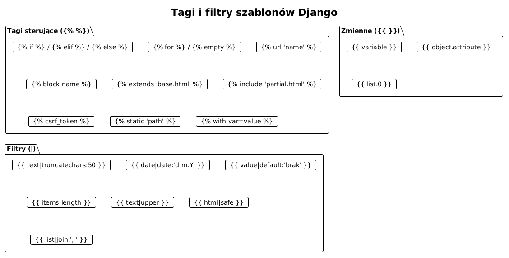
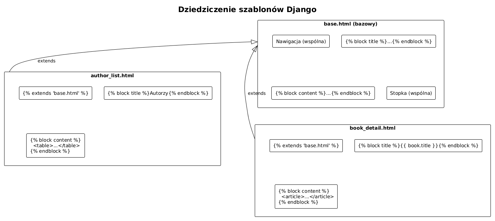

# Temat 04 – Szablony HTML: język szablonów Django, dziedziczenie

## Czym jest szablon w Django?

**Szablon (Template)** to plik HTML z wbudowanym językiem szablonów Django (DTL – Django Template Language).
Oddziela prezentację (HTML/CSS) od logiki biznesowej (Python).

Zasada: **w szablonie nie ma logiki biznesowej** – tylko prezentacja danych.

```
views.py → context (słownik) → template.html → HTML
```

---

## Język szablonów Django (DTL)

DTL używa trzech rodzajów konstrukcji:

| Składnia | Przeznaczenie | Przykład |
|----------|--------------|---------|
| `{{ variable }}` | Wyświetlenie wartości | `{{ author.last_name }}` |
| `` | Tagi sterujące (if, for, url...) | `` |
| `{# komentarz #}` | Komentarz (niewidoczny w HTML) | `{# TODO: poprawić #}` |

---

## Zmienne i dostęp do atrybutów

```html
<!-- Prosta zmienna -->
<p>{{ title }}</p>

<!-- Atrybut obiektu -->
<p>{{ author.first_name }} {{ author.last_name }}</p>

<!-- Element słownika -->
<p>{{ user.profile.bio }}</p>

<!-- Element listy (indeks) -->
<p>Pierwsza książka: {{ books.0.title }}</p>

<!-- Wywołanie metody (bez nawiasów!) -->
<p>{{ author.full_name }}</p>
```

---

## Tagi sterujące

### ``

```html

    <p>Mamy {{ books|length }} książek.</p>

    <p>Czekamy na dostawę.</p>

    <p>Brak książek w katalogu.</p>


<!-- Operatory: and, or, not, ==, !=, <, >, in, not in -->

    <p>Zalogowany użytkownik (nie admin)</p>

```

### ``

```html
<ul>

    <li>{{ forloop.counter }}. {{ book.title }} ({{ book.year }})</li>

    <li>Brak książek.</li>

</ul>
```

Zmienne pętli `forloop`:

| Zmienna | Znaczenie |
|---------|-----------|
| `forloop.counter` | Licznik od 1 |
| `forloop.counter0` | Licznik od 0 |
| `forloop.revcounter` | Odwrócony licznik |
| `forloop.first` | `True` dla pierwszego elementu |
| `forloop.last` | `True` dla ostatniego elementu |
| `forloop.parentloop` | Pętla nadrzędna (zagnieżdżenie) |

### ``

```html
<!-- Odwrócony URL – zawsze używaj nazwy, nie ścieżki na sztywno -->
<a href="">Wszyscy autorzy</a>
<a href="">{{ author }}</a>
<a href="">Edytuj</a>
```

### `` – ochrona przed CSRF

```html
<form method="post" action="">
       <!-- OBOWIĄZKOWE w każdym formularzu POST! -->
    {{ form.as_p }}
    <button type="submit">Zapisz</button>
</form>
```

CSRF (Cross-Site Request Forgery) to atak polegający na wykonaniu nieautoryzowanej akcji
w imieniu zalogowanego użytkownika. Token weryfikuje, że żądanie pochodzi z Twojej strony.

### `` – pliki statyczne

```html

<link rel="stylesheet" href="">

```

### `` – częściowe szablony

```html
<!-- Wstaw inny szablon w tym miejscu -->

```

---

## Filtry

Filtry modyfikują wartości zmiennych: `{{ value|filter:argument }}`.

```html
<!-- Skróć do 50 znaków -->
{{ book.description|truncatechars:50 }}

<!-- Data w formacie polskim -->
{{ book.created_at|date:"d.m.Y H:i" }}

<!-- Wartość domyślna gdy puste -->
{{ book.isbn|default:"brak ISBN" }}
{{ book.isbn|default_if_none:"nieznany" }}

<!-- Długość kolekcji -->
{{ books|length }}

<!-- Zmiana wielkości liter -->
{{ author.first_name|upper }}
{{ author.first_name|lower }}
{{ author.full_name|title }}

<!-- Zaznaczanie HTML jako bezpieczny (używaj OSTROŻNIE) -->
{{ article.body|safe }}

<!-- Łączenie listy -->
{{ genres|join:", " }}

<!-- Linebreaks – zamień \n na <br> -->
{{ author.bio|linebreaks }}

<!-- Slice – wycinek listy -->
{{ books|slice:":5" }}    <!-- pierwsze 5 -->
```



---

## Dziedziczenie szablonów

Dziedziczenie to najważniejsza cecha DTL. Zamiast kopiować nawigację i stopkę do każdej strony,
definiujesz **szablon bazowy** i **wypełniasz bloki** w szablonach pochodnych.

### base.html – szablon bazowy

```html
<!DOCTYPE html>
<html lang="pl">
<head>
    <meta charset="UTF-8">
    <meta name="viewport" content="width=device-width, initial-scale=1">
    <title>Półka z Książkami</title>
    
    <link rel="stylesheet" href="">
</head>
<body>
    <nav>
        <a href="">Strona główna</a>
        <a href="">Autorzy</a>
        <a href="">Książki</a>
    </nav>

    <main class="container">
        
            
                <div class="alert alert-{{ message.tags }}">{{ message }}</div>
            
        

        
        {# Tutaj wstawiają się treści z szablonów pochodnych #}
        
    </main>

    <footer>
        <p>&copy; 2024 Półka z Książkami</p>
    </footer>
</body>
</html>
```

### author_list.html – szablon pochodny

```html


Autorzy – Półka z Książkami


<h1>Lista autorów</h1>

<a href="" class="btn btn-primary">
    + Dodaj autora
</a>


<table>
    <thead>
        <tr>
            <th>Autor</th>
            <th>Rok urodzenia</th>
            <th>Liczba książek</th>
            <th>Akcje</th>
        </tr>
    </thead>
    <tbody>
    
        <tr>
            <td>
                <a href="">
                    {{ author.first_name }} {{ author.last_name }}
                </a>
            </td>
            <td>{{ author.birth_year|default:"–" }}</td>
            <td>{{ author.books.count }}</td>
            <td>
                <a href="">Edytuj</a>
                <a href="">Usuń</a>
            </td>
        </tr>
    
    </tbody>
</table>

    <p>Brak autorów w katalogu. <a href="">Dodaj pierwszego!</a></p>


```



---

## Formularz Django w szablonie

```html


{{ title }}


<h1>{{ title }}</h1>

<form method="post">
    

    {{ form.as_p }}
    {# Renderuje każde pole jako <p><label>...</label><input></p> #}

    {# Alternatywnie: #}
    {# {{ form.as_table }} – jako <tr><td>...</td></tr> #}
    {# {{ form.as_ul }}    – jako <li>...</li> #}

    <div class="form-actions">
        <button type="submit" class="btn">Zapisz</button>
        <a href="">Anuluj</a>
    </div>
</form>


<div class="error-summary">
    <p>Popraw błędy:</p>
    {{ form.errors }}
</div>



```

### Renderowanie pola po polu (więcej kontroli)

```html
<form method="post">
    

    <div class="field error">
        <label for="{{ form.first_name.id_for_label }}">Imię:</label>
        {{ form.first_name }}
        
            <span class="error-msg">{{ form.first_name.errors.0 }}</span>
        
    </div>

    <div class="field">
        <label for="{{ form.last_name.id_for_label }}">Nazwisko:</label>
        {{ form.last_name }}
        
            <span class="error-msg">{{ error }}</span>
        
    </div>

    <button type="submit">Zapisz</button>
</form>
```

---

## Szablony częściowe (include)

Dla powtarzających się fragmentów stwórz osobny plik:

```html
<!-- catalog/templates/catalog/partials/book_card.html -->
<div class="book-card">
    <h3><a href="">{{ book.title }}</a></h3>
    <p>{{ book.author.full_name }} ({{ book.year|default:"rok nieznany" }})</p>
    <p>{{ book.description|truncatechars:120 }}</p>
</div>
```

```html
<!-- W głównym szablonie: -->

    

```

---

## Komunikaty flash (messages)

```python
# views.py
from django.contrib import messages

def author_create(request):
    if request.method == 'POST':
        form = AuthorForm(request.POST)
        if form.is_valid():
            author = form.save()
            messages.success(request, f"Autor „{author}" został dodany.")
            return redirect('catalog:author_list')
```

```html
<!-- base.html – wyświetl komunikaty -->

    <div class="alert alert-{{ message.tags }}">
        {{ message }}
    </div>

```

---

## Konfiguracja szablonów w settings.py

```python
TEMPLATES = [
    {
        'BACKEND': 'django.template.backends.django.DjangoTemplates',
        'DIRS': [BASE_DIR / 'templates'],  # globalne szablony projektu
        'APP_DIRS': True,                  # szablony w <app>/templates/
        'OPTIONS': {
            'context_processors': [
                'django.template.context_processors.debug',
                'django.template.context_processors.request',
                'django.contrib.auth.context_processors.auth',
                'django.contrib.messages.context_processors.messages',
            ],
        },
    },
]
```

### Zalecana struktura szablonów

```
catalog/
└── templates/
    └── catalog/          ← namespace aplikacji (zapobiega kolizjom)
        ├── base.html     ← szablon bazowy całej aplikacji
        ├── home.html
        ├── author_list.html
        ├── author_detail.html
        ├── author_form.html
        ├── author_confirm_delete.html
        ├── book_list.html
        ├── book_detail.html
        ├── book_form.html
        ├── book_confirm_delete.html
        └── partials/
            └── book_card.html
```

---

## Pliki statyczne (CSS, JS, obrazy)

```python
# settings.py
STATIC_URL = '/static/'
STATICFILES_DIRS = [BASE_DIR / 'static']
```

```css
/* static/css/style.css */
body { font-family: sans-serif; max-width: 1000px; margin: 0 auto; }
nav a { margin-right: 1rem; }
table { width: 100%; border-collapse: collapse; }
th, td { padding: 0.5rem; border: 1px solid #ccc; }
.btn { padding: 0.4rem 0.8rem; background: #0077cc; color: white; border: none; cursor: pointer; }
```

---

## Mini-lab: szablony w praktyce

1. Stwórz `base.html` z nawigacją do autorów i książek.
2. Stwórz `author_list.html` dziedziczący z `base.html` – tabela autorów z linkami.
3. Stwórz `author_detail.html` – szczegóły autora + lista jego książek.
4. Użyj `` z `` i zmiennej `forloop.counter`.
5. Dodaj filtr `|truncatechars:80` do biogramów w liście.
6. Zaimplementuj formularz autora z `` i obsługą błędów.
7. Dodaj `` dla karty książki i użyj jej w kilku miejscach.

---

## Pytania kontrolne

1. Jakie są trzy rodzaje konstrukcji w języku szablonów Django?
2. Wyjaśnij dziedziczenie szablonów – czym jest `` i ``?
3. Dlaczego `` jest wymagany w formularzach POST?
4. Jaka jest różnica między tagiem a filtrem?
5. Do czego służy ``?
6. Jak zdefiniować własny filtr szablonu?

---

## Literatura

- Django Docs – Templates: <https://docs.djangoproject.com/en/stable/topics/templates/>
- Django Docs – Built-in template tags and filters: <https://docs.djangoproject.com/en/stable/ref/templates/builtins/>
- Django Docs – Template inheritance: <https://docs.djangoproject.com/en/stable/ref/templates/language/#template-inheritance>
- Django Tutorial, część 3: <https://docs.djangoproject.com/en/stable/intro/tutorial03/>
- MDN – Django Templates: <https://developer.mozilla.org/en-US/docs/Learn/Server-side/Django/Home_page>

