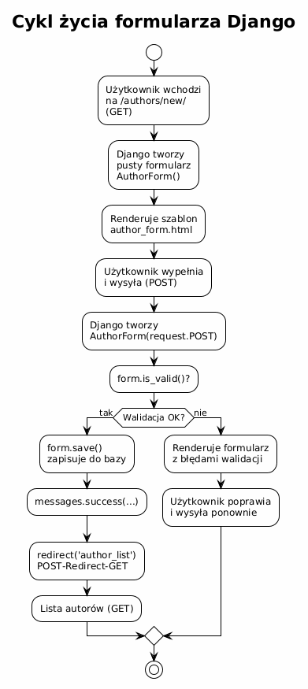
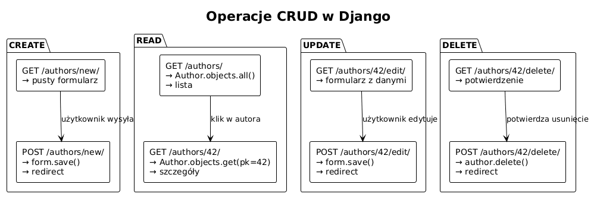

# Temat 05 – Formularze i CRUD: walidacja, Create/Update/Delete

## Czym jest formularz Django?

**Formularz Django** (`django.forms.Form` lub `ModelForm`) to klasa Pythona, która:
1. Definiuje pola formularza i ich walidację,
2. Generuje HTML pól formularza,
3. Sprawdza poprawność danych przesłanych przez użytkownika,
4. (dla `ModelForm`) Zapisuje dane bezpośrednio do bazy.

---

## ModelForm – formularz powiązany z modelem

Zamiast przepisywać pola z modelu do formularza, Django oferuje `ModelForm`:

```python
# catalog/forms.py
from django import forms
from .models import Author, Book


class AuthorForm(forms.ModelForm):
    class Meta:
        model = Author
        fields = ['first_name', 'last_name', 'birth_year', 'bio']
        # Alternatywnie: fields = '__all__'  (wszystkie pola)
        # Lub: exclude = ['created_at']  (wszystkie oprócz wymienionych)
        widgets = {
            'bio': forms.Textarea(attrs={'rows': 4, 'cols': 60}),
            'birth_year': forms.NumberInput(attrs={'min': 1000, 'max': 2024}),
        }
        labels = {
            'first_name': 'Imię',
            'last_name': 'Nazwisko',
            'birth_year': 'Rok urodzenia',
            'bio': 'Biogram (krótki)',
        }
        help_texts = {
            'birth_year': 'Np. 1798 dla Adama Mickiewicza.',
        }


class BookForm(forms.ModelForm):
    class Meta:
        model = Book
        fields = ['title', 'author', 'year', 'isbn', 'description']
        widgets = {
            'description': forms.Textarea(attrs={'rows': 5}),
            'author': forms.Select(attrs={'class': 'select-field'}),
        }

    def clean_year(self):
        """Walidacja niestandardowa – rok wydania."""
        year = self.cleaned_data.get('year')
        if year and (year < 1450 or year > 2100):
            raise forms.ValidationError(
                "Rok wydania musi być między 1450 a 2100."
            )
        return year

    def clean_isbn(self):
        """ISBN musi mieć 10 lub 13 cyfr (lub być pusty)."""
        isbn = self.cleaned_data.get('isbn', '').replace('-', '').replace(' ', '')
        if isbn and len(isbn) not in (10, 13):
            raise forms.ValidationError(
                "ISBN musi zawierać 10 lub 13 cyfr."
            )
        return isbn
```

---

## Walidacja formularzy – szczegóły

Django wykonuje walidację w trzech krokach:

```
1. Walidacja pola (field.validate())   – typ danych, required, max_length...
2. Metody clean_<pole>()               – niestandardowa logika pola
3. Metoda clean()                      – walidacja między polami
```

### Walidacja między polami (`clean()`)

```python
class BookForm(forms.ModelForm):
    class Meta:
        model = Book
        fields = ['title', 'author', 'year', 'isbn', 'description']

    def clean(self):
        cleaned_data = super().clean()
        title  = cleaned_data.get('title')
        author = cleaned_data.get('author')

        # Sprawdź czy taka książka już istnieje (przy tworzeniu)
        if title and author:
            if Book.objects.filter(title=title, author=author).exists():
                raise forms.ValidationError(
                    f"Książka „{title}" tego autora już istnieje."
                )
        return cleaned_data
```

### `cleaned_data` – dane po walidacji

```python
if form.is_valid():
    # Dostęp do zwalidowanych, przekonwertowanych danych:
    first_name = form.cleaned_data['first_name']   # str
    birth_year = form.cleaned_data['birth_year']   # int lub None
```

---

## Pełna implementacja CRUD dla Author

### views.py

```python
# catalog/views.py
from django.shortcuts import render, get_object_or_404, redirect
from django.contrib import messages
from .models import Author, Book
from .forms import AuthorForm, BookForm


# ─── READ: lista i szczegóły ────────────────────────────────────────────────

def author_list(request):
    query   = request.GET.get('q', '')
    authors = Author.objects.all()
    if query:
        authors = authors.filter(last_name__icontains=query)
    return render(request, 'catalog/author_list.html', {
        'authors': authors,
        'query':   query,
    })


def author_detail(request, pk):
    author = get_object_or_404(Author, pk=pk)
    books  = author.books.order_by('-year')
    return render(request, 'catalog/author_detail.html', {
        'author': author,
        'books':  books,
    })


# ─── CREATE ─────────────────────────────────────────────────────────────────

def author_create(request):
    if request.method == 'POST':
        form = AuthorForm(request.POST)
        if form.is_valid():
            author = form.save()
            messages.success(request, f'Autor „{author}" został dodany.')
            return redirect('catalog:author_detail', pk=author.pk)
    else:
        form = AuthorForm()
    return render(request, 'catalog/author_form.html', {
        'form':  form,
        'title': 'Nowy autor',
    })


# ─── UPDATE ─────────────────────────────────────────────────────────────────

def author_update(request, pk):
    author = get_object_or_404(Author, pk=pk)
    if request.method == 'POST':
        form = AuthorForm(request.POST, instance=author)   # ← instance!
        if form.is_valid():
            form.save()
            messages.success(request, f'Dane autora „{author}" zostały zaktualizowane.')
            return redirect('catalog:author_detail', pk=author.pk)
    else:
        form = AuthorForm(instance=author)   # formularz wypełniony danymi
    return render(request, 'catalog/author_form.html', {
        'form':   form,
        'title':  f'Edycja: {author}',
        'author': author,
    })


# ─── DELETE ─────────────────────────────────────────────────────────────────

def author_delete(request, pk):
    author = get_object_or_404(Author, pk=pk)
    if request.method == 'POST':
        name = str(author)
        author.delete()
        messages.warning(request, f'Autor „{name}" i jego książki zostały usunięte.')
        return redirect('catalog:author_list')
    return render(request, 'catalog/author_confirm_delete.html', {
        'author': author,
        'books':  author.books.all(),
    })
```

### Kluczowa różnica: CREATE vs UPDATE

```python
# CREATE – nowy obiekt
form = AuthorForm(request.POST)
author = form.save()       # INSERT INTO catalog_author ...

# UPDATE – istniejący obiekt (instance=...)
form = AuthorForm(request.POST, instance=author)
form.save()                # UPDATE catalog_author SET ... WHERE id=42
```




---

## Szablony dla CRUD

### author_confirm_delete.html

```html

Usuń autora


<h1>Usuń autora: {{ author }}</h1>


<div class="alert alert-warning">
    <strong>Uwaga!</strong> Usunięcie autora spowoduje usunięcie
    {{ books.count }} książki(książek):
    <ul>
    
        <li>{{ book.title }}</li>
    
    </ul>
</div>


<form method="post">
    
    <p>Czy na pewno chcesz usunąć autora <strong>{{ author }}</strong>?</p>
    <button type="submit" class="btn btn-danger">Tak, usuń</button>
    <a href="" class="btn">Anuluj</a>
</form>

```

---

## CRUD dla Book – specyfika ForeignKey w formularzu

Formularz książki zawiera pole `author` (ForeignKey). Django automatycznie renderuje
je jako `<select>` z listą autorów.

```python
# Filtrowanie dostępnych autorów (opcjonalnie)
class BookForm(forms.ModelForm):
    class Meta:
        model = Book
        fields = ['title', 'author', 'year', 'isbn', 'description']

    def __init__(self, *args, **kwargs):
        super().__init__(*args, **kwargs)
        # Sortuj autorów w select po nazwisku
        self.fields['author'].queryset = Author.objects.order_by('last_name', 'first_name')
        self.fields['author'].empty_label = "-- Wybierz autora --"
```

```python
# views.py – widok tworzenia książki, opcjonalnie z prefill autora
def book_create(request):
    initial = {}
    author_pk = request.GET.get('author')   # /books/new/?author=5
    if author_pk:
        initial['author'] = author_pk

    if request.method == 'POST':
        form = BookForm(request.POST)
        if form.is_valid():
            book = form.save()
            messages.success(request, f'Książka „{book.title}" została dodana.')
            return redirect('catalog:book_detail', pk=book.pk)
    else:
        form = BookForm(initial=initial)

    return render(request, 'catalog/book_form.html', {
        'form':  form,
        'title': 'Nowa książka',
    })
```

---

## Formularz zwykły (nie ModelForm)

Czasem potrzebujemy formularza, który nie odpowiada bezpośrednio modelowi:

```python
class SearchForm(forms.Form):
    query = forms.CharField(
        max_length=200,
        required=False,
        label="Szukaj",
        widget=forms.TextInput(attrs={'placeholder': 'Tytuł lub autor...'}),
    )
    year_from = forms.IntegerField(required=False, label="Rok od")
    year_to   = forms.IntegerField(required=False, label="Rok do")

    def clean(self):
        cleaned = super().clean()
        y_from = cleaned.get('year_from')
        y_to   = cleaned.get('year_to')
        if y_from and y_to and y_from > y_to:
            raise forms.ValidationError("'Rok od' musi być ≤ 'Rok do'.")
        return cleaned
```

```python
# Użycie w widoku
def book_search(request):
    form    = SearchForm(request.GET or None)
    results = Book.objects.none()

    if form.is_valid():
        q      = form.cleaned_data.get('query', '')
        y_from = form.cleaned_data.get('year_from')
        y_to   = form.cleaned_data.get('year_to')

        results = Book.objects.all()
        if q:
            results = results.filter(title__icontains=q)
        if y_from:
            results = results.filter(year__gte=y_from)
        if y_to:
            results = results.filter(year__lte=y_to)

    return render(request, 'catalog/book_search.html', {
        'form':    form,
        'results': results,
    })
```

---

## Typy widgetów HTML

```python
# forms.py
class ExampleForm(forms.Form):
    text     = forms.CharField(widget=forms.TextInput)
    password = forms.CharField(widget=forms.PasswordInput)
    text_area = forms.CharField(widget=forms.Textarea(attrs={'rows': 5}))
    number   = forms.IntegerField(widget=forms.NumberInput)
    checkbox = forms.BooleanField(widget=forms.CheckboxInput)
    select   = forms.ChoiceField(
        choices=[('', '---'), ('py', 'Python'), ('js', 'JavaScript')],
        widget=forms.Select,
    )
    multi    = forms.MultipleChoiceField(
        choices=[('a', 'A'), ('b', 'B'), ('c', 'C')],
        widget=forms.CheckboxSelectMultiple,
    )
    date     = forms.DateField(widget=forms.DateInput(attrs={'type': 'date'}))
    hidden   = forms.CharField(widget=forms.HiddenInput)
```

---

## Mini-lab: pełny CRUD w praktyce

1. Stwórz `AuthorForm` i `BookForm` jak w przykładach.
2. Zaimplementuj widoki: `author_list`, `author_detail`, `author_create`, `author_update`, `author_delete`.
3. Podłącz widoki do URL-i.
4. Stwórz szablony HTML dla wszystkich widoków.
5. Dodaj obsługę komunikatów flash (`messages`).
6. Dodaj wyszukiwanie na liście autorów (parametr GET `?q=...`).
7. Na stronie szczegółów autora dodaj przycisk „Dodaj książkę" z prefill autora.
8. Przetestuj CASCADE: usuń autora i sprawdź, że jego książki znikają.

---

## Pytania kontrolne

1. Czym różni się `Form` od `ModelForm`?
2. Jaką rolę pełni parametr `instance` przy edycji?
3. Dlaczego po udanym POST robimy redirect (wzorzec PRG)?
4. Gdzie piszemy walidację niestandardową – w `clean_<pole>()` czy w `clean()`?
5. Jak Django chroni formularze przed CSRF?
6. Jak zrealizować usunięcie obiektu bez panelu admina?

---

## Literatura

- Django Docs – Forms: <https://docs.djangoproject.com/en/stable/topics/forms/>
- Django Docs – ModelForm: <https://docs.djangoproject.com/en/stable/topics/forms/modelforms/>
- Django Docs – Form and field validation: <https://docs.djangoproject.com/en/stable/ref/forms/validation/>
- Django Docs – Form widgets: <https://docs.djangoproject.com/en/stable/ref/forms/widgets/>
- Django Tutorial, część 4: <https://docs.djangoproject.com/en/stable/intro/tutorial04/>
- MDN – Django Forms: <https://developer.mozilla.org/en-US/docs/Learn/Server-side/Django/Forms>
- OWASP CSRF: <https://owasp.org/www-community/attacks/csrf>

