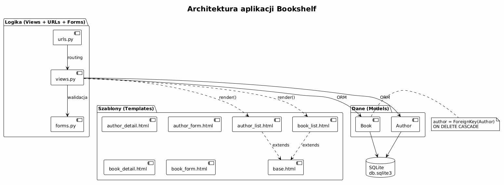
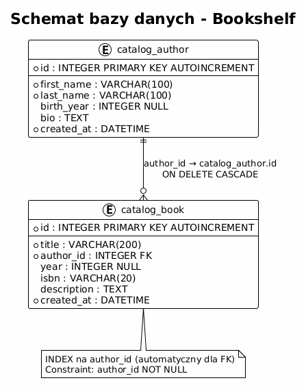

# Temat 06 – Kompletna aplikacja: Półka z Książkami

## Opis aplikacji

**Bookshelf** (Półka z Książkami) to przykładowa aplikacja Django demonstrujące
pełny CRUD (Create, Read, Update, Delete) dla dwóch modeli powiązanych relacją
**jeden-do-wielu** (1:N):

- `Author` (Autor) – jeden autor może mieć wiele książek
- `Book` (Książka) – każda książka należy do jednego autora

Aplikacja używa bazy **SQLite**, wszystkie operacje są dostępne w interfejsie
użytkownika (bez panelu admina).

---

## Architektura aplikacji



### Schemat bazy danych



---

## Uruchamianie

### Wymagania

- Python 3.10+
- Django 4.2+

### Instalacja i start

```bash
# Przejdź do katalogu projektu
cd src/_09-Django/06-complete-app/bookshelf

# Utwórz wirtualne środowisko
python -m venv venv
source venv/bin/activate       # Linux/macOS
.\venv\Scripts\Activate.ps1    # Windows PowerShell

# Zainstaluj zależności
pip install -r requirements.txt

# Wykonaj migracje (tworzy db.sqlite3)
python manage.py migrate

# (Opcjonalnie) Załaduj przykładowe dane
python manage.py loaddata catalog/fixtures/initial_data.json

# (Opcjonalnie) Utwórz konto administratora
python manage.py createsuperuser

# Uruchom serwer deweloperski
python manage.py runserver
```

Otwórz przeglądarkę pod adresem **http://127.0.0.1:8000/**

Panel admina: **http://127.0.0.1:8000/admin/**

---

## Uruchamianie testów

```bash
# Przez pytest (zalecane)
cd src/_09-Django/06-complete-app/bookshelf
pytest

# Przez manage.py
python manage.py test catalog

# Verbose
pytest -v --tb=short
```

---

## Struktura projektu

```
bookshelf/                      ← katalog projektu
├── manage.py                   ← narzędzie zarządzania
├── requirements.txt            ← zależności
├── pytest.ini                  ← konfiguracja testów
├── db.sqlite3                  ← baza danych (po migrate)
│
├── bookshelf/                  ← konfiguracja projektu
│   ├── __init__.py
│   ├── settings.py             ← konfiguracja Django
│   ├── urls.py                 ← główne URL-e
│   └── wsgi.py
│
└── catalog/                    ← aplikacja katalogu
    ├── __init__.py
    ├── apps.py                 ← konfiguracja aplikacji
    ├── models.py               ← modele Author i Book
    ├── forms.py                ← ModelForm dla obu modeli
    ├── views.py                ← widoki CRUD (FBV)
    ├── urls.py                 ← URL-e aplikacji
    ├── admin.py                ← rejestracja w panelu admina
    ├── tests.py                ← testy jednostkowe (35 testów)
    ├── migrations/
    │   └── 0001_initial.py     ← migracja tworzą tabele
    ├── fixtures/
    │   └── initial_data.json   ← przykładowe dane
    └── templates/catalog/
        ├── base.html           ← szablon bazowy (CSS w <style>)
        ├── home.html           ← strona główna
        ├── author_list.html    ← lista autorów + szukaj
        ├── author_detail.html  ← szczegóły + książki autora
        ├── author_form.html    ← formularz (create/update)
        ├── author_confirm_delete.html
        ├── book_list.html      ← lista książek + szukaj
        ├── book_detail.html    ← szczegóły książki
        ├── book_form.html      ← formularz (create/update)
        └── book_confirm_delete.html
```

---

## URL-e aplikacji

| Metoda | URL | Widok | Nazwa |
|--------|-----|-------|-------|
| GET | `/` | `home` | `catalog:home` |
| GET | `/authors/` | `author_list` | `catalog:author_list` |
| GET | `/authors/new/` | `author_create` | `catalog:author_create` |
| POST | `/authors/new/` | `author_create` | `catalog:author_create` |
| GET | `/authors/<pk>/` | `author_detail` | `catalog:author_detail` |
| GET | `/authors/<pk>/edit/` | `author_update` | `catalog:author_update` |
| POST | `/authors/<pk>/edit/` | `author_update` | `catalog:author_update` |
| GET | `/authors/<pk>/delete/` | `author_delete` | `catalog:author_delete` |
| POST | `/authors/<pk>/delete/` | `author_delete` | `catalog:author_delete` |
| GET | `/books/` | `book_list` | `catalog:book_list` |
| GET | `/books/new/` | `book_create` | `catalog:book_create` |
| POST | `/books/new/` | `book_create` | `catalog:book_create` |
| GET | `/books/<pk>/` | `book_detail` | `catalog:book_detail` |
| GET | `/books/<pk>/edit/` | `book_update` | `catalog:book_update` |
| POST | `/books/<pk>/edit/` | `book_update` | `catalog:book_update` |
| GET | `/books/<pk>/delete/` | `book_delete` | `catalog:book_delete` |
| POST | `/books/<pk>/delete/` | `book_delete` | `catalog:book_delete` |

---

## Kluczowe fragmenty kodu

### Model z relacją ForeignKey

```python
# catalog/models.py
class Book(models.Model):
    title  = models.CharField(max_length=200)
    author = models.ForeignKey(
        Author,
        on_delete=models.CASCADE,   # usunięcie autora usuwa jego książki
        related_name='books',       # author.books.all()
    )
    year   = models.IntegerField(null=True, blank=True)
```

### Widok CRUD – wzorzec POST-Redirect-GET

```python
# catalog/views.py
def author_create(request):
    if request.method == 'POST':
        form = AuthorForm(request.POST)
        if form.is_valid():
            author = form.save()                          # INSERT
            messages.success(request, f'Dodano {author}')
            return redirect('catalog:author_detail', pk=author.pk)  # PRG
    else:
        form = AuthorForm()                               # pusty formularz
    return render(request, 'catalog/author_form.html', {'form': form})
```

### Szablon z dziedziczeniem

```html


Autorzy


<h1>Autorzy</h1>

    <a href="">
        {{ author.last_name }}, {{ author.first_name }}
    </a>


```

---

## Testy – co jest sprawdzane (35 testów)

| Klasa testów | Liczba testów | Zakres |
|---|---|---|
| `AuthorModelTests` | 5 | `__str__`, `full_name`, sortowanie, opcjonalne pola |
| `BookModelTests` | 5 | `__str__`, FK, `related_name`, CASCADE, optional year |
| `AuthorFormTests` | 4 | walidacja, pola wymagane, birth_year bounds |
| `BookFormTests` | 5 | ISBN, year bounds, walidacja, opcjonalne pola |
| `AuthorViewTests` | 10 | list, detail, create (GET/POST), update, delete + CASCADE |
| `BookViewTests` | 6 | list, detail, create, update, delete, search |
| `HomeViewTests` | 2 | status 200, liczniki |

---

## Zadania do samodzielnego rozwiązania

### Zadanie 1 – Paginacja
Dodaj paginację (np. po 5 elementów na stronie) do listy książek i autorów.
Skorzystaj z Django Paginator: `django.core.paginator.Paginator`.

### Zadanie 2 – Sortowanie
Na stronie listy książek dodaj możliwość sortowania po: tytule, autorze, roku.
Użyj parametru GET `?sort=year` i przekaż go do `order_by()`.

### Zadanie 3 – Statystyki autora
Na stronie szczegółów autora wyświetl: liczbę książek, zakres lat wydania
(najstarsza i najnowsza), używając ORM: `aggregate(Min('year'), Max('year'))`.

### Zadanie 4 – Walidacja unikalności
W `BookForm` dodaj walidację, że kombinacja tytuł + autor jest unikalna przy tworzeniu.

### Zadanie 5 – Genre (gatunek)
Dodaj nowy model `Genre` (gatunek literacki) i relację Many-to-Many z `Book`.
Wyświetl gatunki na stronie szczegółów książki i umożliw ich przypisanie w formularzu.

### Zadanie 6 – CBV
Przepisz widoki `AuthorListView` i `AuthorDetailView` na klasy dziedziczące
z `ListView` i `DetailView`. Porównaj ilość kodu z FBV.

---

## Pytania kontrolne

1. Jak Django realizuje relację 1:N w bazie danych (jaki SQL generuje)?
2. Co się stanie z książkami po usunięciu autora przy `on_delete=CASCADE`?
3. Wyjaśnij wzorzec POST-Redirect-GET na przykładzie `author_create`.
4. Jak `AuthorForm(request.POST, instance=author)` różni się od `AuthorForm(request.POST)`?
5. Do czego służy `` w szablonie?
6. Dlaczego `select_related('author')` w `book_list` zmniejsza liczbę zapytań SQL?
7. Jak Django chroni formularze przed atakiem CSRF?
8. Co to jest fixture i jak załadować dane testowe?

---

## Literatura

- Django Tutorial (pełny, 7 części): <https://docs.djangoproject.com/en/stable/intro/tutorial01/>
- Django Docs – Testing: <https://docs.djangoproject.com/en/stable/topics/testing/>
- Django Docs – Forms: <https://docs.djangoproject.com/en/stable/topics/forms/>
- W. S. Vincent, *Django for Beginners*: <https://djangoforbeginners.com/>
- MDN – Django Web Framework: <https://developer.mozilla.org/en-US/docs/Learn/Server-side/Django>
- Two Scoops of Django: <https://www.feldroy.com/books/two-scoops-of-django-3-x>

